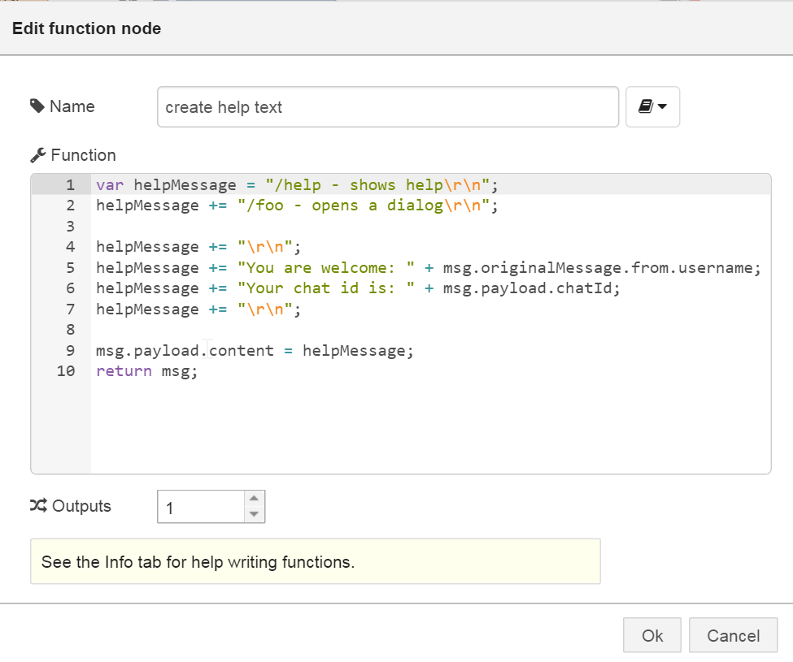
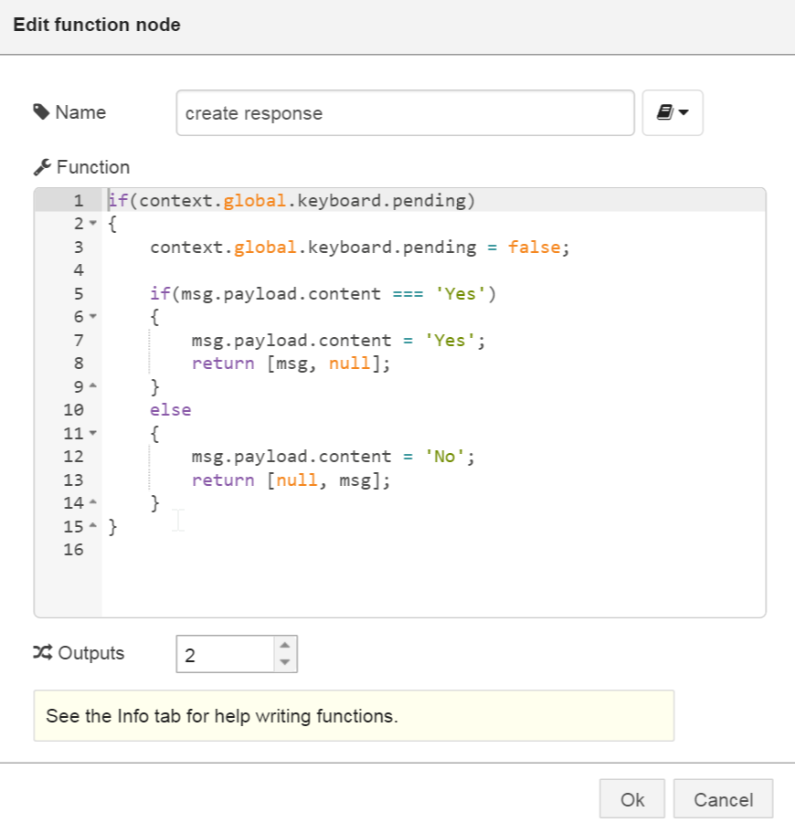
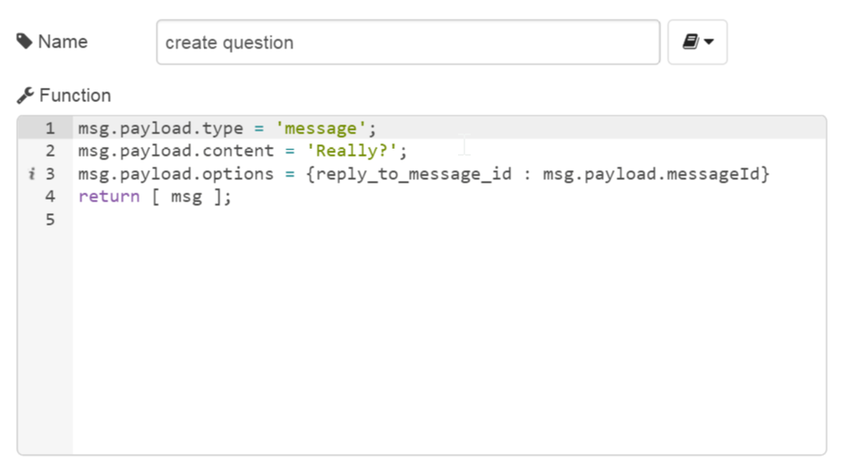
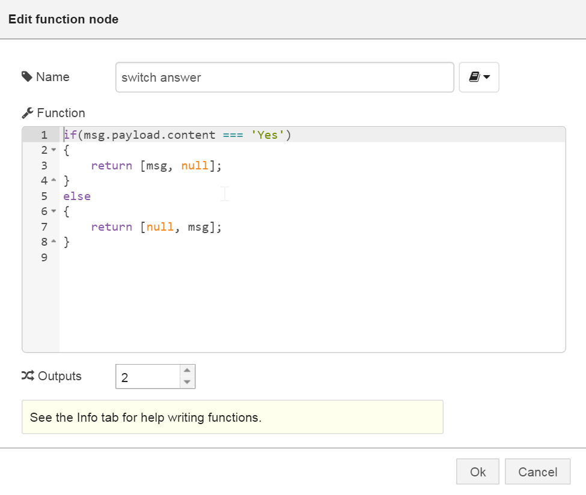
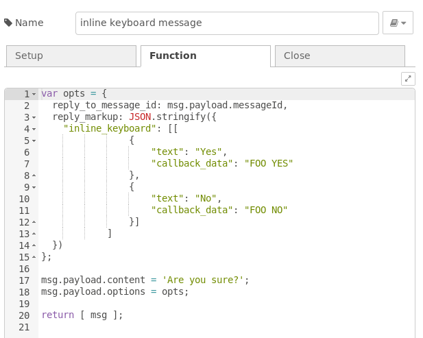
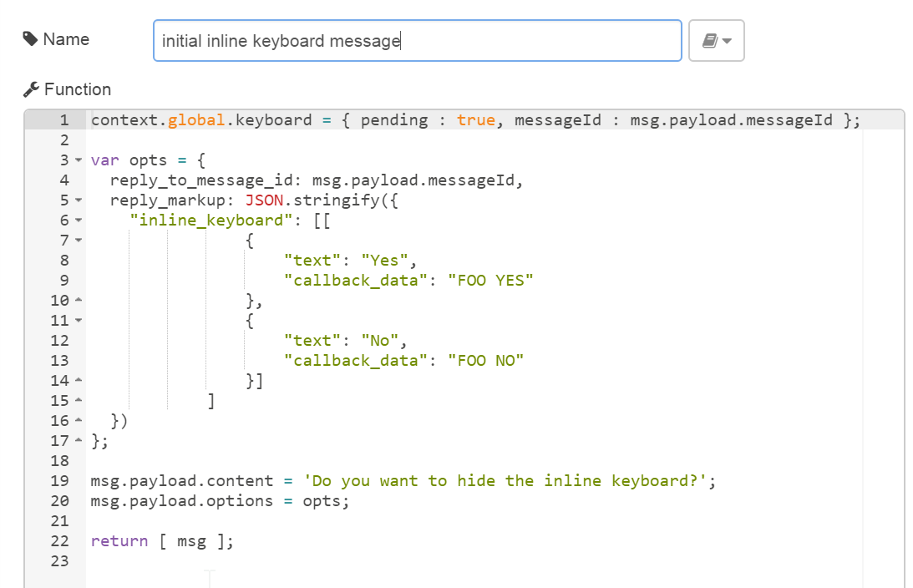
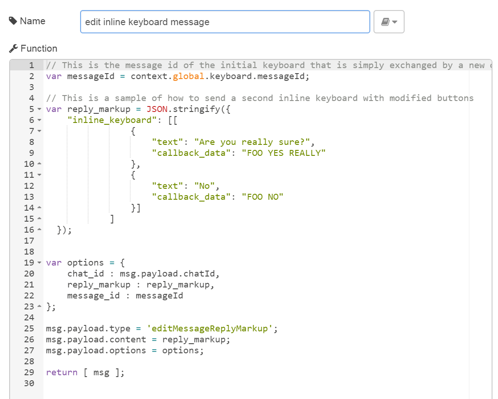
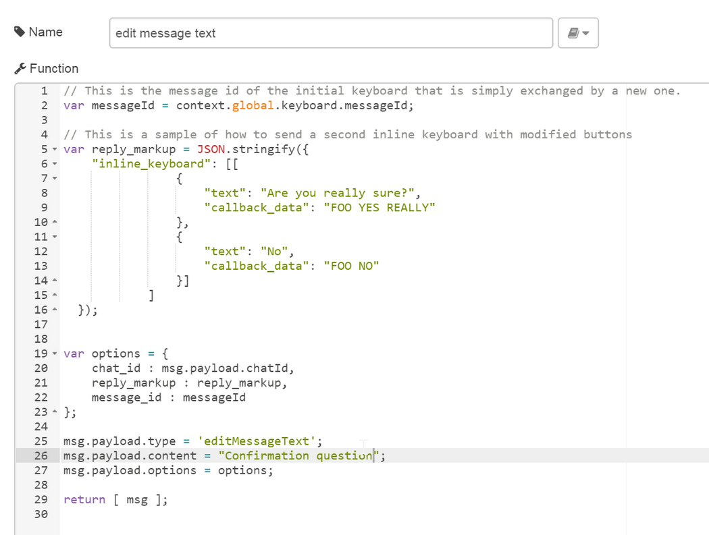

xxx ToDo
- Bilder numerieren
- Typos in 99-telegrambot.html suchen

# Telegram bot nodes for node-red
[](https://nodered.org)


[](https://www.npmjs.org/package/node-red-contrib-telegrambot)
[](https://snyk.io/test/npm/node-red-contrib-telegrambot)
[](https://t.me/nodered_telegrambot)


This package contains a receiver and a sender node which act as a Telegram Bot.
The only thing required is the `token` that can be retrieved by the `@botfather` [Telegram Bot](https://core.telegram.org/bots).

# Thanks for your donation
If you want to support this free project. Any help is welcome. You can donate by clicking one of the following links:
<a target="blank" href="https://blockchain.com/btc/payment_request?address=1PBi7BoZ1mBLQx4ePbwh1MVoK2RaoiDsp5"></a>
<a target="blank" href="https://www.paypal.me/windkh"></a>

# Live support
## Get help
If you have an urgent problem, hire a mentor for a 1:1 live session on Git-Start:
[](https://git-start.com/help-request/create/windkh%2Fnode-red-contrib-telegrambot)

## Provide help
Help others in paid 1:1 live sessions to get started.
[](https://git-start.com/help-request/overview/windkh%2Fnode-red-contrib-telegrambot)

# Credits
 - dvv (Vladimir Dronnikov): for providing the saveDataDir configuration option
 - snippet-java: for adding venue messages and for providing the markdown problem fallback
 - greenstone7: for providing the callback query node
 - dceejay: for cleaning up the project
 - psyntium: for providing the weblink for additional content link videos, pictures, animations, audio files
 - MatthiasHunziker: for extending the callback query node to support generic events
 - Skiepp: for providing the send chat action idea.
 - MK-2001: for providing the sendMediaGroup function.
 - cowchimp: for adding the support for `Node-RED v1.0+` (async)
 - JokerQyou: for adding the support for using webhook without certificate 
 - bonastreyair: for providing ideas for improving the command node

# Dependencies
The nodes are tested with `Node.js v8.11.1` and `Node-RED v0.20.3`. It also supports `Node-RED v1.0+`.
 - [node-telegram-bot-api](https://github.com/yagop/node-telegram-bot-api)
 - [socks5-https-client](https://github.com/mattcg/socks5-https-client)

# Changelog
Changes can be followed [here](/CHANGELOG.md).

# Usage
## Basics
The input node receives messages from the bot and sends a message object with the following layout:

`msg.payload` contains the message details
 - **chatId** : the unique id of the chat. This value needs to be passed to the out node when responding to the same chat
 - **type** : the type of message received: message, photo, audio, location, video, animation, voice, contact
 - **content** : received message content: string or file_id, or object with full data (location, contact)

`msg.originalMessage` contains the original message object from the underlying [node-telegram-bot-api](https://github.com/yagop/node-telegram-bot-api) lib.

The output node sends the content to a specified chat. The node's input `msg` object is similar to the output `msg` object of the receiver node.

A simple echo flow looks like:

 
[echo flow](examples/echo.json)  
**Fig. 1:** Simple echo flow 

## Configuration Node
The mandatory configuration entries are 
- the *Bot-Name* and 
- the *Token* 

which you received from @botfather when creating a new bot. 

  
**Fig. 2:** Configuration node dialog 


### Configuration properties *Users* and *ChatIds*
The node contains the two optional properties: ***Users*** and ***ChatIds***. You may enter a list of names and/or chatIds that are authorized to use this bot. This is useful, if the bot should only accept incoming calls from dedicated persons resp. chat groups.
The values in the property fields must be separated by a , e.g.: 
Hugo,Sepp,Egon 
Leave the fields blank if you do not want to use this feature to mask senders.

### Configuration property *Server URL*
This is the server url of the telegram server (https://api.telegram.org). If you use a different instance of a telegram server somewhere else (e.g. on premise) you could then use this property to connect to that server instead the global one.

Typically this field is left blank.


### Configuration property *Update Mode*
The update mode can be chosen from *Polling* or *Webhook*.

#### Polling mode
By default the bot is polling every 300ms for new messages. This polling interval can be set via the property ***Poll Interval*** in the *Polling Options*.

#### Webhook mode
The *Webhook* method may be chosen to avoid polling.
As a prerequisite you have to create your own certificate as described there: 
https://core.telegram.org/bots/webhooks 
https://stackoverflow.com/questions/42713926/what-is-easy-way-to-create-and-use-a-self-signed-certification-for-a-telegram-we
One of many pitfalls when creating certificates (that don't work) is, that the value CN you provided to openssl must match the bots domain name: see *Bot Host* below.

Create our pair of private and public keys using the following command:
```
openssl req -newkey rsa:2048 -sha256 -nodes -keyout PRIVATE.key -x509 -days 365 -out PUBLIC.pem -subj "/C=NG/ST=Lagos/L=Lagos/O=YOUR_NAME_OR_COMPANY_NAME/CN=SERVER_NAME_OR_IP"
```
Important: 
Replace *SERVER_NAME_OR_IP* with the name you entered in the configuration node under ***Bot Host*** in the *Webhook Options*. Both names must be equal, otherwise the telegram server won't send updates to your bot.
You should also replace *YOUR_NAME_OR_COMPANY_NAME* with some value. 

Note that the certificate will expire after 365 days and needs to be renewed (e.g. see [there](https://securitywing.com/how-renew-self-signed-ssl-certificate-openssl-tool-linux/)).

Webhook can also be used without certificate but then the bot host must be behind a tunnel see https://github.com/windkh/node-red-contrib-telegrambot/pull/93.

### Configuration property flag *Use SOCKS5*
SOCKS5 proxy support is optional when running behind a SOCKS5 proxy that requires authentication. In this case, additional configuration properties have to be set in the configuration node.

### Configuration property flag *Verbose Logging*
The ***Verbose Logging*** flag should only be activated when debugging network problems as this will create cyclic warnings when the network is down.


## Receiver Node
This node can **receive telegram messages** sent to the bot and also **receive messages from a chat**. 

  
**Fig. 3:** Receiver node appearance 

**Telegram messages** sent to the bot are automatically received (if not masked via the configuration node property *Users*).

To be able to receive **telegram chat messages**, simply invite the bot to a chat. If the configuration node property *ChatIds* is not set, all chat messages are received.

You can control if the bot receives every message by calling **/setprivacy @botfather** (refer also to [there](https://core.telegram.org/bots#privacy-mode)).

### Outputs
The original message from the underlying node library is stored in `msg.originalMessage`. The `msg.payload` contains the most important data like **chatId**, **type** and **content**. The content format depends on the message type. E.g. if you receive a message then the content format is a string, if you receive a location, the content format is an object containing latitude and longitude. 

Basically the node's first output (***Standard Output***) is used for the `msg` object.  
The node's second output (***Unauthorized Output***) is triggered when security is applied (via configuration properties *Users* and *ChatIds*) and the telegram message sender is not authorized to access the bot. 

The following `msg.payload.type` contents can be received (see type in output `msg` object):
- **message** - content is text
- **photo** - content is the file_id of the photo with the highest resolution
- **audio** - content is the file_id of the audio file
- **document** - content is the file_id of the document
- **sticker** - content is the file_id of the sticker
- **animation** - content is the file_id of the animation file
- **video** - content is the file_id of the video file
- **video_note** - content is the file_id of the video note file
- **voice** - content is the file_id of the voice file
- **location** - content is an object with latitude and longitude
- **venue** - content is the venue object
- **contact** - content is the contact information object
- **invoice** - content is an invoice for a payment
- **successful_payment** - content is a service message about a successful payment

Note that media groups are received not as a group, but as separate messages of type photo and video. 

The following `msg.payload.type` contents indicate changes in the group or channel itself: 
- **new_chat_title** - content is the new chat title
- **new_chat_photo** - content is the file_id (see photo)
- **new_chat_members** - content is an array of new chat members
- **left_chat_member** - content is an object describing the chat member that left
- **delete_chat_photo** - content is true
- **pinned_message** - content is the pinned message object
- **channel_chat_created** - content is true
- **group_chat_created** - content is true
- **supergroup_chat_created** - content is true
- **migrate_from_chat_id** - content is the chat id. The chat property describes the chat.
- **migrate_to_chat_id** - content is the chat id. The chat property describes the chat.

For more details of the content types listed above also refer to the [telegram api description](https://core.telegram.org/bots/api#available-types).

### Configuration property *Download Directory*
When the receiver node receives data like videos, documents and so on, the file is downloaded automatically to the local harddisc when the node's property ***Download Directory*** is set in the configuration node. The directory may also be part of the message payload: `msg.payload.path`.
In addition to that the message object may contain the direct download link in the payload: `msg.payload.weblink`.

### Configuration property *Filter*
Normally, a receiver node receives all content that is sent to the bot. However if you have command nodes next to a receiver you can enable the *commands* flag in the configuration property ***Filter*** so that commands meant for a command node will not be handled by the receiver node.


## Sender Node
This node **sends contents** to a telegram user or to a telegram chat. It is triggered by an incoming `msg` object at its input containing all necessary telegram information.
  
**Fig. 4:** Sender node appearance

### Inputs
The input `msg.payload` must contain the following fields:
- `msg.payload.chatId`  - **chatId** or an **array of chatIds** if you want to send the same message to several chats
- `msg.payload.type`    - e.g. **message**, **document**, **photo**, etc. (see section *Receiver Node* above)
- `msg.payload.content` - your message content (e.g. message text)

### Outputs
Basically the input `msg` object is forwarded unchanged to the node's output. In case of an exception within the node the output `msg` object is extended by `msg.error`. 

### Issueing API commands
Additionally to sending content, the sender node can be used to issue commands direct to the API. In this case the `msg.payload` fields contain (see examples for further details):
- `msg.payload.type` - one of the commands listed below
- `msg.payload.content` - required command arguments
- `msg.payload.options` (optional) - additional command arguments


The `msg.payload.type` needs to be set to one of the following values:
- editMessageCaption
- editMessageText
- editMessageReplyMarkup
- deleteMessage
- editMessageLiveLocation
- stopMessageLiveLocation
- callback_query
- inline_query
- action
- leaveChat
- kickChatMember
- unbanChatMember
- restrictChatMember
- promoteChatMember
- exportChatInviteLink
- setChatPhoto
- deleteChatPhoto
- setChatTitle
- setChatDescription
- pinChatMessage
- unpinChatMessage
- getChatAdministrators
- getChatMembersCount
- getChat
- getChatMember
- sendInvoice
- answerShippingQuery
- answerPreCheckoutQuery


# xxx Hier geht's weiter..


## Command Node
  
**Fig. 5:** Command node appearance


The command node can be used for triggering a message when a specified command is received: e.g. help.
See example below. It has two outputs:
 1. is triggered when the command is received
 2. is triggered when the command is not received

The second one is useful when you want to use a keyboard. See example below.
Commands usually start with a / like for example /foo. According to the telegram api documentation the command
should be issued following the bot name like /foo@YourBot. This is important when you add several different bots
to one single group chat. To avoid that the bot handles commands that are not directly sent to it using the long notation
you can set the "strict" mode in the options of the command node. In this case the bot only accepts the full command
notation in group chats.  
The second output is only issued if a command was received before. If another ocmmand was triggered in the meantime the 
pending status of the first one is reset. The state is stored per user and per chat.


## Event Node
  
**Fig. 6:** Event node appearance


The node receives events from the bot like:
- callback_query of inline keyboards.
See example-flow [inline keyboard flow](examples/inlinekeyboard.json) in examples folder.
- inline_query
- edited_message which is triggered when someone alters an already sent message.
- edited_message_text which is triggered when someone alters an already sent message text.
- edited_message_caption which is triggered when someone alters an already sent caption e.g. of a photo.
- channel_post which is triggered when the bot is member of a public channel (/setprivacy to disabled!).
- edited_channel_post which is triggeren when someone alters an already sent message in a public channel.
- edited_channel_post_text which is triggeren when someone alters an already sent message text in a public channel.
- edited_channel_post_caption which is triggeren when someone alters an already sent caption of e.g. a photo in a public channel.


## Reply Node
  
**Fig. 7:** Reply node appearance

The reply node waits for an answer to a specified message. It should be used in conjunction with the sender node:
See example below.


# Examples
All example flows can be found in the examples folder of this package.

## Implementing a simple echo
This example is self-explaining. The received message is returned to the sender.


[echo flow](examples/echo.json)
**Fig. 8:** Simple echo flow 


## Implementing a /help command
This flow returns the help message of your bot. It receives the command and creates a new message, which is returned:

**Fig. 9:** Help command flow example 

The shown function node may contain:


**Fig. 10:** Help command function example 

**Note**: You can access the sender's data via the `msg.originalMessage` property.


## Implementing a keyboard
Keyboards are very useful for getting additional data from the sender.
When the command is received the first output is triggered and a dialog is opened:

[keyboard flow](examples/keyboard.json)
**Fig. 11:** Keyboard example 

The *confirmation message* function node may contain:


**Fig. 12:** Keyboard confirmation message function example 

The answer is send to the second output triggering the lower flow. Data is passed via global properties here.  
The *create response* function node may contain: 


**Fig. 13:** Keyboard create response function example 

## Implementing an on reply node
Next to the keyboard the bot could also ask a question and wait for the answer.
When the user responds to a specified message the telegram reply node can be used:

[onreplymessage flow](examples/onreplymessage.json)
**Fig. 14:** On reply example flow 
The *create question* function node may contain:


**Fig. 15:** On reply create question function example 

The question is sent to the chat. This node triggers the on reply node waiting for the answer.

**Note**: The user has to explicitly respond to this message. If the user only writes some text,
the get reply node will not be triggered.

The function node *switch answer* shows how to evaluate the answer using a function node with two outputs:


**Fig. 16:** On reply switch answer function example 


## Implementing an inline keyboard
An inline keyboard contains buttons that can send a callback query back to the bot to trigger any kind of function.
When the command is received the first output is triggered and a inline keyboard is shown:


[inlinekeyboard flow](examples/inlinekeyboard.json)
**Fig. 17:** Inline keyboard example flow 

The *inline keyboard message* function node may contain:


**Fig. 18:** Inline keyboard message function example 

The callback query is received by the event node. It must be answered like shown as follows.
There you can add your code to trigger the desired bot command. The answer contains the callback query data in `msg.payload.content`.


**Fig. 19:** Inline keyboard set answer options function example 


## Edit an inline keyboard
An inline keyboard can be modified using the 'editMessageReplyMarkup' instruction. To be able to modify an existing message you need to know the messageId of the message of the keyboard.
A sample flow is provided in the examples folder and could look like this:

[editinlinekeyboard flow](examples/editinlinekeyboard.json)
**Fig. 20:** Edit an inline keyboard example flow 

The *initial inline keyboard message* function node may contain:


**Fig. 21:** Inline keyboard initial inline keyboard message function example 

The message id needs to be saved in the flow or global context. This is just a demo assuming that there is only one single chat:


**Fig. 22:** Storing messageId function example 

As next the initial keyboard has to be replaced with a modified one using the magic 'editMessageReplyMarkup' command as type.


**Fig. 23:** Replace keyboard function example 

The following switch node just handles the response and hides the keyboard using another magic command: 'deleteMessage':


**Fig. 24:** Handling the keyboard response function example 

As an alternative to 'editMessageReplyMarkup' you can also use 'editMessageText' to replace the keyboard and also the text as follows:


**Fig. 25:** Alternatively replacing the initial keyboard and the text function example 


## Implementing an inline_query 
Bots can be called from any chat via inline_query when the bot is set to inline mode in botfather via /setinline
see https://core.telegram.org/bots/api#inline-mode
A sample flow is provided in the examples folder and could look like this:

[inlinequery flow](examples/inlinequery.json)
**Fig. 26:** inline_query example flow 

# xxx Hier geht's weiter mit Bildunterschriften


The inline_query must be answered by sending a results array.
see https://core.telegram.org/bots/api#inlinequeryresult
The example just returns two simple articles, but almost every kind of content can be returned. 


Note that the inline_query can also contain the location of the sender. To enable this call /setinlinegeo in botfather
 

## Receiving a location
Locations can be send to the chat. The bot can receive the longitude and latitude:


## Sending messages to a specified chat
If you have the chatId, you can send any message without the need of having received something before.

[sendmessagetochat flow](examples/sendmessagetochat.json)


## Sending photos, videos, ...
Next to sending text messages you can send almost any content like photos and videos. Set the right type and content and you are done.
If you want to respond to a received message with a picture you could write:
```
msg.payload.content = 'foo.jpg';
msg.payload.type = 'photo';
```

**Note**: that the chatId is already the correct one when you reuse the received msg object from a receiver node.

You can use one of the following types to send your file as content:
- [photo](examples/sendphoto.json)
- audio
- video
- video_note
- sticker
- animation
- voice
- document

Note that some clients convert gif animations to videos. This will lead to problems when passing a received animation object to the
sender node as the content is mp4 instead of gif.
The content can be downloaded automatically to a local folder by setting the saveDataDir entry in the configuration node.
You can add a caption to photo, audio, document, video, animation, voice by setting the caption property as follows:
```
msg.payload.caption = "You must have a look at this!";
```

The following types require a special content format to be used. See the underlying node api for further details.
- location
- contact
- venue
- mediaGroup


**Fig. xxx:** Photo sending example flow 


### Sending a mediaGroup as album 

To send several photos as an album you can use the mediaGroup. For the type of media group you have to set the content to an array of object type [InputMediaPhoto](https://core.telegram.org/bots/api#inputmediaphoto). 
Please review the Json below.

```javascript
msg.payload = {
    "chatId": 123456789,
    "messageId": 1,
    "type": "mediaGroup",
    "content": [
        {
            "type": "photo",
            "media": "/pic/frame_1.jpg"
        },
        {
            "type": "photo",
            "media": "/pic/frame_2.jpg"
        },
        {
            "type": "photo",
            "media": "/pic/frame_3.jpg"
        },
        {
            "type": "photo",
            "media": "/pic/frame_4.jpg"
        }
    ]
}
```
[sendmediagroup flow](examples/sendmediagroup.json)


## Sending contact
Sending a contact is limited to the fields supported by the underlying API to "phone_number" and "first_name".
But you can also receive "last_name" if the client sends it.

```
msg.payload.type = 'contact';
msg.payload.content : {  phone_number: "+49 110", first_name: "Polizei" };
```


[sendcontacttochat flow](examples/sendcontacttochat.json)
**Fig. xxx:** Sending contact example flow 


## Sending chat actions
When the bot needs some time for further processing but you want to give a hint to the user what is going on,
then you can send a chat action which will appear at the top of the channel of the receiver. 

```
msg.payload.type = 'action';
msg.payload.content = "typing";
```

The content can be one of the following 
- "typing" for text messages
- "upload_photo" for photos
- "record_video" or "upload_video" for videos
- "record_audio" or "upload_audio" for audio files
- "upload_document" for general files
- "find_location" for location data
- "record_video_note" or "upload_video_note" for video notes

The following example illustrate how to send for example "typing...".
Of course a real bot would send the real data after finishing the processing, but this is not part of the example.
[sendchataction flow](examples/sendchataction.json)


## Sending live locations
Locations can be send to the chat as described above and then updated afterwards: live location update.
To achieve this you have to provide the live_period in seconds in the options when sending the location.

```
msg.payload.type = 'location';
msg.payload.content = {
    latitude : lat,
    longitude : lng
};

msg.payload.options = {
    live_period : time
};  
```

To be able to update this location message you need to store the message id of that sent message.
This can be done by storing it somewhere in the flow context as follows:

```
var messageId = msg.payload.sentMessageId;
flow.set("messageId", messageId);
```

Now you can edit the location as often as you want within the live_period:

```
var messageId = flow.get("messageId");
var chatId = msg.payload.chatId;

msg.payload.type = 'editMessageLiveLocation';
msg.payload.content = {
    latitude : lat,
    longitude : lng
};
  
msg.payload.options = {
    chat_id : chatId,
    message_id : messageId
};  
```

If you want to abort updating the location then you can send the stopMessageLiveLocation command.

```
var messageId = flow.get("messageId");
var chatId = msg.payload.chatId;

msg.payload.type = 'stopMessageLiveLocation';
msg.payload.options = {
    chat_id : chatId,
    message_id : messageId
};  
```


[livelocation flow](examples/livelocation.json)
**Fig. xxx:** Sending live location example flow 

## Receiving live location updates
When a user sends his location then it is received by the standard message receiver node.
But when a live location is updated, then you will receive the same message event as one would
edit an already existing message in the chat (edit_message). The example above contains an event handler node that
receives those message edits, and filters for the ones that contain a location. 


## Forwarding message
All types of  messages can be forwarded to another chat (see forwardMessage).
Just send a message to the sender node and add forward property to the payload.
The forward object must contain the id of the chat the message should be sent to.
In the following example the received message will be forwarded to the chat 1:

```
msg.payload.forward = { chatId : 1 };
return msg;
```
See example-flow [forward message](examples/forwardmessage.json) in examples folder.

The message id to forward is taken from: `msg.payload.messageId`. 
The source chat id is taken from: `msg.payload.chatId`.
Both properties are set by the receiver node, but you can also manually set those manually without having received anything.
The following example sends message 2 from chat 1 to chat 3 (if you have sufficient permissions).

```
msg.payload.chatId = 1;
msg.payload.messageId = 2;
msg.payload.forward = { chatId : 3 };
return msg;
```

## Advanced options when sending messages.
Text messages can be in markdown format to support fat and italic style. To enable markdown format
set the parse_mode options property as follows:
```
msg.payload.options = {parse_mode : "Markdown"};
```

Telegram always adds a preview when you send a web link. To suppress this behavior you can disable the preview
by setting the options property as follows:
```
msg.payload.options = {disable_web_page_preview : true};
```

The callback query answer has a show_alert option to control the visibility of the answer on the client.
It is directly mapped to the options property.
```
msg.payload.options = true;
```


## Configuring security
The configuration node contains two properties for applying security to your bot. You can choose between configuring
the single usernames or configure one or more chat-ids that are allowed to access the bot. The values must be separated using a comma like shown in the screenshot.


**Note**: that the chat-ids are positive in chats where you talk to the bot in an 1:1 manner. A negative chat-id indicates a group-chat.
Everybody in this group is allowed to use the bot if you enter the chat-id of the group into the lower field of the configuration node.


## Detecting unauthorized access.
The receiver node has a second output, that is triggered when authorization fails. The message is send to this output for further processing.
You can reply on that message or log it to a file to see who wanted to access your bot.


[unauthorizedaccess flow](examples/unauthorizedaccess.json)
**Fig. xxx:** Detecting unautorized access example flow 

The message needs to be formatted before the log to file node can be triggered. A simple function could look like this:


## Dynamic authorization
If you want to authorize and unauthorize users or chats during runtime you can insert a script into the config instead of a hard coded list.
The script starts with { and ends with }.
Generally spoken you can make use of the context in two ways (e.g. in a function node):
1. context.global.maykey = myvalue; // = old notation
2. global.set(mykey, myvalue); // = new notation

Only the latter one can be seen in the context browser window while the first is only stored as variable in memory.
For using a dynamic list stored in the context you must add a script into the configuration (in the row Users and/or ChatIds):
1. {context.global.hereyourkey} for approach one
2. {gobal.get("hereyoukey")} for approach two

If the config starts with { and ends with } the expression is evaluated as script.
For example you can write something like
```
{context.global.username}
{context.global.chatids}
```
or 
```
{global.get("usernames")}
{global.get("chatids")}
```

I would recommend using the latter notation.


The authorization can be modified using a change node:


As an alternative the authorization can be modified using a function node:

(not that you can also use the function node with the new notation like gobal.set(key, value).
[dynamic authorization flow](examples/dynamicauthorization.json)

## Payments
This feature is under construction. See 
https://core.telegram.org/bots/payments
https://core.telegram.org/bots/api#sendinvoice
[send invoice flow](examples/sendinvoice.json)

## Implementing a simple bot
Putting all pieces together you will have a simple bot implementing some useful functions.


[simplebot flow](examples/simplebot.json)
**Fig. xxx:** Simple bot example flow 


# License
Author: Karl-Heinz Wind

The MIT License (MIT)
Copyright (c) <year> <copyright holders>

Permission is hereby granted, free of charge, to any person obtaining a copy of this software and associated documentation files (the "Software"), to deal in the Software without restriction, including without limitation the rights to use, copy, modify, merge, publish, distribute, sublicense, and/or sell copies of the Software, and to permit persons to whom the Software is furnished to do so, subject to the following conditions:

The above copyright notice and this permission notice shall be included in all copies or substantial portions of the Software.

THE SOFTWARE IS PROVIDED "AS IS", WITHOUT WARRANTY OF ANY KIND, EXPRESS OR IMPLIED, INCLUDING BUT NOT LIMITED TO THE WARRANTIES OF MERCHANTABILITY, FITNESS FOR A PARTICULAR PURPOSE AND NON-INFRINGEMENT. IN NO EVENT SHALL THE AUTHORS OR COPYRIGHT HOLDERS BE LIABLE FOR ANY CLAIM, DAMAGES OR OTHER LIABILITY, WHETHER IN AN ACTION OF CONTRACT, TORT OR OTHERWISE, ARISING FROM, OUT OF OR IN CONNECTION WITH THE SOFTWARE OR THE USE OR OTHER DEALINGS IN THE SOFTWARE.
