# Telegram bot nodes for Node-RED
[](https://nodered.org)

[](https://www.npmjs.com/package/node-red-contrib-telegrambot)
[](https://www.npmjs.com/package/node-red-contrib-telegrambot)
[](https://www.npmjs.org/package/node-red-contrib-telegrambot)
[](https://snyk.io/test/npm/node-red-contrib-telegrambot)
[](https://t.me/nodered_telegrambot)
[](http://packagequality.com/#?package=node-red-contrib-telegrambot)

[](https://github.com/windkh/node-red-contrib-telegrambot/issues)
[](https://github.com/windkh/node-red-contrib-telegrambot/issues?q=is%3Aissue+is%3Aclosed)
...


This package contains a receiver and a sender node which act as a Telegram Bot.
The only thing required is the `token` that can be retrieved by the `@botfather` [Telegram Bot](https://core.telegram.org/bots).

# Thanks for your donation
If you want to support this free project. Any help is welcome. You can donate by clicking one of the following links:
<a target="blank" href="https://blockchain.com/btc/payment_request?address=1PBi7BoZ1mBLQx4ePbwh1MVoK2RaoiDsp5"></a>
<a target="blank" href="https://www.paypal.me/windkh"></a>

<a href="https://www.buymeacoffee.com/windka" target="_blank"></a>


# Credits
 - dvv (Vladimir Dronnikov): for providing the saveDataDir configuration option
 - snippet-java: for adding venue messages and for providing the markdown problem fallback
 - greenstone7: for providing the callback query node
 - dceejay: for cleaning up the project
 - psyntium: for providing the weblink for additional content link videos, pictures, animations, audio files
 - MatthiasHunziker: for extending the callback query node to support generic events
 - Skiepp: for providing the send chat action idea.
 - MK-2001: for providing the sendMediaGroup fuhttps://github.com/yagop/node-telegram-bot-apinction
 - cowchimp: for adding the support for `Node-RED v1.0+` (async)
 - JokerQyou: for adding the support for using webhook without certificate
 - bonastreyair: for providing ideas for improving the command node
 - StephanStS: for extension/clearification/beautification of Readme.md and finding minor bugs
 - Diddlik: for extending webhook options
 - MorbidDevil: for extending answerInlineQuery with options
 - daredoes: for providing the webhook decumentation on Unraid/Docker with SWAG/NGINX/REVERSE-PROXY
 - kickouille: for fixing the payment functions and providing the full payment example flow
 - skrashevich: for providing approveChatJoinRequest, declineChatJoinRequest
 - ShotokanZH: for providing the web app data example
 

# Installation
[](https://nodei.co/npm/node-red-contrib-telegrambot/)

You can install the nodes using node-red's "Manage palette" in the side bar.

Or run the following command in the root directory of your Node-RED installation

    npm install node-red-contrib-telegrambot --save


# Dependencies
The nodes are tested with `Node.js v16.6.0` and `Node-RED v2.0.5`.
 - [node-telegram-bot-api](https://github.com/yagop/node-telegram-bot-api)
 - [socks-proxy-agent](https://www.npmjs.com/package/socks-proxy-agent)

# Changelog
Changes can be followed [here](/CHANGELOG.md).

# Hints
- It is recommended to always do a full deploy when you changed some of the nodes of this library to prevent unexpected behavior.
- Do not use a token in more than one configuration node at the same time as the telegram server does not allow multiple connections for one bot. 


# Usage
## Basics
### Receiver and sender nodes
The *Telegram receiver* node receives messages from the bot and sends a message object with the following layout:

`msg.payload` contains the message details with the following elements:
- ***chatId*** : The unique id of the chat. This value needs to be passed to the out node when responding to the same chat
- ***type*** : The type of message received. Types see table below
- ***content*** : Received message content: String or file_id, or object with full data (location, contact)
- Additional:
 - ***date*** (Optional element): Date the message was sent in Unix time (integer)
 - **further elements** depending on the *type* (see table below)

`msg.originalMessage` contains the original message object from the underlying [**node-telegram-bot-api**](https://github.com/yagop/node-telegram-bot-api) lib.

The *Telegram sender* node sends the content to a specified username or chat. The node's input `msg` object is similar to the output `msg` object of the *Telegram receiver* node. Some of the additional elements are mandatory and some are optional (see table below).

A simple echo flow looks like:

  
[**echo flow**](examples/echo.json)  
**Fig. 1:** Simple echo flow

### Types of telegram messages

The following message contents can be sent and received (given in `msg.payload.type`):
- **message** - content is text
- **photo** - content is the file_id of the photo with the highest resolution
- **audio** - content is the file_id of the audio file
- **document** - content is the file_id of the document
- **sticker** - content is the file_id of the sticker
- **animation** - content is the file_id of the animation file
- **dice** - content is a dice
- **video** - content is the file_id of the video file
- **video_note** - content is the file_id of the video note file
- **voice** - content is the file_id of the voice file
- **location** - content is an object with latitude and longitude
- **venue** - content is the venue object
- **contact** - content is the contact information object
- **poll** - content is a poll object
- **invoice** - content is an invoice for a payment
- **successful_payment** - content is a service message about a successful payment

Note that media groups are sent/received not as a group, but as separate messages of type photo and video.

The following `msg.payload.type` contents indicate changes in the group or channel itself:
- **new_chat_title** - content is the new chat title
- **new_chat_photo** - content is the file_id (see photo)
- **new_chat_members** - content is an array of new chat members
- **left_chat_member** - content is an object describing the chat member that left
- **delete_chat_photo** - content is true
- **pinned_message** - content is the pinned message object
- **channel_chat_created** - content is true
- **group_chat_created** - content is true
- **supergroup_chat_created** - content is true
- **migrate_from_chat_id** - content is the chat id. The chat property describes the chat.
- **migrate_to_chat_id** - content is the chat id. The chat property describes the chat.

For more details of the content types listed above also refer to the [**telegram api description**](https://core.telegram.org/bots/api#available-types).


### Message types and corresponding *content* elements in `msg.payload`
The `msg.payload` contains several elements additional to *chatId*, *type* and *content*. These additional elements depend on the contents of `msg.payload.type`. In addition the format of `msg.payload.content` depends on the *type*.  

The following table shows the relationship between the message *type* and additional elements.


| *msg.payload.type* | *msg.payload.content* | *chat* | *caption* | *blob* | *photos* | *mediaGroupId* |
| :- | :- | :-: | :-: | :-: | :-: | :-: |
| **message** | text |-|-|-|-|-|
| **photo** | photo[index].file_id |-| optional | true | + | optional |
| **audio**| audio.file_id | - | optional | true | - | - |
| **dice**| dice |  - | -  | false | - | - |
| **sticker**| sticker.file_id |  - | -  | true | - | - |
| **animation**| animation.file_id | - | optional | true | - | optional |
| **video**| video.file_id |  - | optional | true | - | optional |
| **video_note**| video_note.file_id | - | - | true | - | - |
| **voice**| voice.file_id | - | optional | true | - | - |
| **location**| location | - | - | - | - | - |
| **venue**| venue | - | - | - | - | - |
| **contact**| contact | - | - | - | - | - |
| **document**| document.file_id | - | optional | true | - | - |
| **poll**| poll | - | - | - | - | - |
| **invoice**| invoice | - | - | - | - | - |
| **successful_payment**| successful_payment | - | - | - | - | - |
| **new_chat_title**| new_chat_title | - | - | - | - | - |
| **new_chat_photo**| new_chat_photo[index].file_id | - | - | true | + | - |
| **new_chat_members**| new_chat_members | - | - | - | - | - |
| **left_chat_member**| left_chat_members | - | - | - | - | - |
| **delete_chat_photo**| delete_chat_photo | - | - | - | - | - |
| **pinned_message**| pinned_message | - | - | - | - | - |
| **channel_chat_created**| channel_chat_created | - | - | - | - | - |
| **group_chat_created**| group_chat_created | + | - | - | - | - |
| **supergroup_chat_created**| supergroup_chat_created |  + | - |- | - | - |
| **migrate_from_chat_id**| migrate_from_chat_id |  + | - | - | - | - |
| **migrate_to_chat_id**| migrate_to_chat_id |  + | - | - | - | - |

Legend:
- **-** : Element is not present in `msg.payload` structure
- **+** : Element is mandatory in `msg.payload` structure
- **optional** : Element is optional in *Sender* node and always present in *Receiver* node
- **true** : Element is mandatory and has to be set to boolean value *true*

**Tab. 1:** Data elements in `msg.payload` depending on `msg.payload.type`


For more details of the content types listed above also refer to the [**telegram api description**](https://core.telegram.org/bots/api#available-types) and the [**telegram bot api description**](https://core.telegram.org/bots/api).


### Error handling
There are two ways of how to handle errors in the sender node:
1. Default: all errors can be handled in a catch-all node. 
2. Enable second output: errors are sent to this additional output. The msg contains an additional `msg.error` property. 

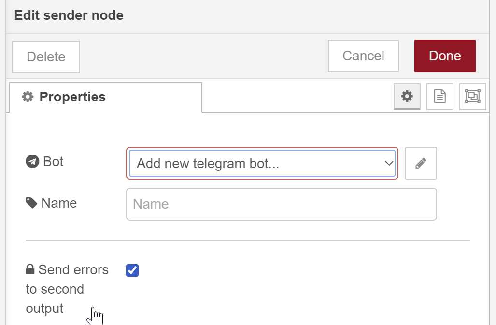

**Fig. 2:** Sender node dialog


  
[**error handling example flow**](examples/errorhandling.json)  


## Configuration Node
The mandatory configuration entries are
- the *Bot-Name* and
- the *Token*

which you received from @botfather when creating a new bot.

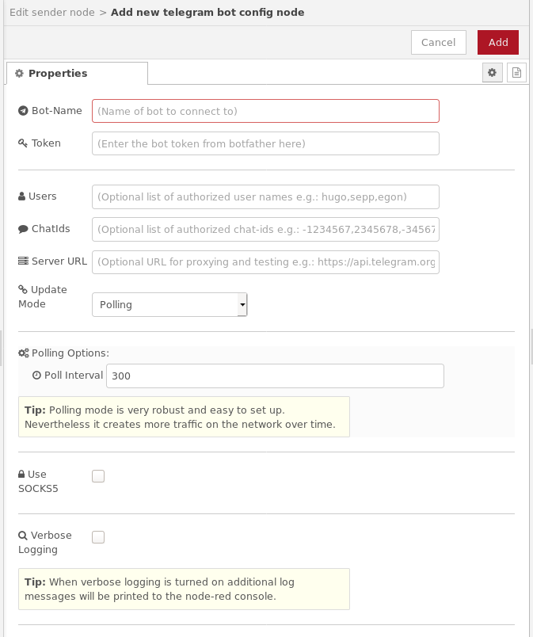

**Fig. 3:** Configuration node dialog


### Reading token from external location
Instead of entering the token from bot father directly into the token field, you can also instruct the node to read ot from on external location.

#### Reading token from environment variable
Environment variables are entered in the settings.js of node-red before startup.   
```javascript
process.env.BOT_TOKEN = "<your bot token here>";
```
The token field in the configuration node must then look like
```javascript
{env.get("BOT_TOKEN")}
```


### Configuration properties *Users* and *ChatIds*
The node contains the two optional properties: ***Users*** and ***ChatIds***. You may enter a list of names and/or chatIds that are authorized to use this bot. This is useful, if the bot should only accept incoming calls from dedicated persons resp. chat groups.
The values in the property fields must be separated by a comma e.g.:
Hugo,Sepp,Egon
Leave the fields *Users* and *ChatIds* blank if you do not want to use this feature to mask senders.

User names can only be used, if a telegram user has set its Username in the Telegram settings. The following screenshot shows the according settings dialog in the Telegram app where you can set your personal preferences:

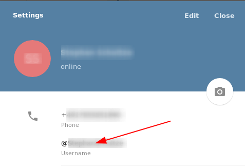

**Fig. 4:** Telegram app settings dialog (example Android phone app)

If no *Username* is set you can only filter via the *ChatId* property.


### Configuration property *Server URL*
This is the server url of the telegram server (https://api.telegram.org). If you use a different instance of a telegram server somewhere else (e.g. on premise) you could then use this property to connect to that server instead the global one.

Typically this field is left blank.


### Configuration property *Update Mode*
The update mode can be chosen from *Polling* or *Webhook*.

#### Polling mode
By default the bot is polling every 300ms for new messages. This polling interval can be set via the property ***Poll Interval*** in the Do you mean a table which describes the logic within the function getMessageDetails(botMsg)?
E.g. a table with these coloumns:
- text: chatId, messageId, type (= "message"), content (text)
- photo: chatId, messageId, type (= "photo"), content (photo[index].file_id with index = different photo sizes), caption, date, blob (= true), photos (???), mediaGroupId
- audio: chatId, messageId, type (= "audio"), content (file_id), cation, date, blob (= true)
...*Polling Options*.

#### Webhook mode
The *Webhook* method may be chosen to avoid polling.

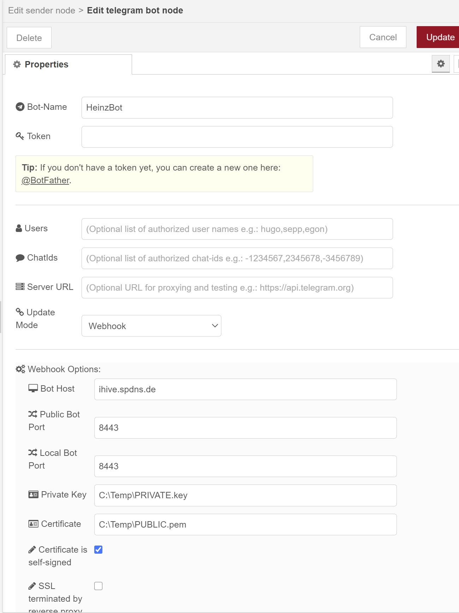

**Fig. 5:** Example configuration for webhook mode

As setting up a webhook can be very complex depending on the infrastructure this was moved to a seprate readme file.
See also [WEBHOOK.md](WEBHOOK.md)


#### None mode
The *None* method may be chosen to avoid traffic due to polling or incoming webhook calls.
You can only send messages using the sender node but you can not receive any data.


### Configuration property flag *Use SOCKS*
SOCKS4/5 proxy support is optional when running behind a SOCKS4/5 proxy that requires authentication. In this case, additional configuration properties have to be set in the configuration node.

As setting up a socks5 proxy can be very complex depending on the infrastructure this was moved to a seprate readme file.
See also [SOCKS5.md](SOCKS5.md)


### Configuration property flag *Verbose Logging*
The ***Verbose Logging*** flag should only be activated when debugging network problems as this will create cyclic warnings when the network is down.


## Receiver Node
This node can **receive telegram messages** sent to the bot and also **receive messages from a chat**.

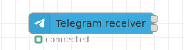  
**Fig. 6:** Receiver node appearance

**Telegram messages** sent to the bot are automatically received (if not masked via the configuration node property *Users*).  
To be able to receive **telegram chat messages**, simply invite the bot to a chat. If the configuration node property *ChatIds* is not set, all chat messages are received.

You can control if the bot receives every message by calling **/setprivacy @botfather** (refer also to [**there**](https://core.telegram.org/bots#privacy-mode)).

### Configuration

#### Configuration property *Download Directory*
When the receiver node receives data like videos, documents and so on, the file is downloaded automatically to the local harddisc when the node's property ***Download Directory*** is set in the configuration node. The directory may also be part of the message payload: `msg.payload.path`.
In addition to that the message object may contain the direct download link in the payload: `msg.payload.weblink`.

#### Configuration property *Filter*
Normally, a receiver node receives all content that is sent to the bot. However if you have command nodes next to a receiver you can enable the *commands* flag in the configuration property ***Filter*** so that commands meant for a command node will not be handled by the receiver node.  
I.e. the command message then only appears in the configured command node and not in this node.


### Outputs
The original message from the underlying node library is stored in `msg.originalMessage`. The `msg.payload` contains the most important data like **chatId**, **type** and **content**. Additional elements are present in the `msg.payload` structure and depend on the message *type*. These additional elements are described in the table **Tab. 1** above.

The content format depends on the message type. E.g. if you receive a text message then the content format is a string, if you receive a location, the content format is an object containing latitude and longitude. See also ["available methods" in the api core description](https://core.telegram.org/bots/api#available-methods).

The node has two outputs:
1. The node's upper output (***Standard Output***) is used if the message is from an authorized user.  
2. The node's lower output (***Unauthorized Output***) is used when security is applied (via configuration properties *Users* and *ChatIds*) and the user is not authorized to access the bot.


## Sender Node
This node **sends contents** to a telegram user or to a telegram chat. It is triggered by an incoming `msg` object at its input containing all necessary telegram information.  
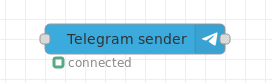  
**Fig. 7:** Sender node appearance

### Inputs
The input `msg.payload` must contain the following elements:
- `msg.payload.chatId`  - **chatId** or an **array of chatIds** if you want to send the same message to several chats
- `msg.payload.type`    - e.g. **message**, **document**, **photo**, etc. (see section *Receiver Node* above)
- `msg.payload.content` - your message content (e.g. message text)

Additional elements are present in the `msg.payload` structure and depend on the message *type*. These additional elements are described in the table **Tab. 1** above.

The content format depends on the message type. E.g. if you send a text message then the content format is a string, if you send a location, the content format is an object containing latitude and longitude. See also ["available methods" in the api core description](https://core.telegram.org/bots/api#available-methods).


### Outputs
Basically the input `msg` object is forwarded unchanged to the node's output. 

The node has up to two outputs (selectable via the *Send errors to second output* flag):
1. The node's first/upper output (***Standard Output***) is used if the message was successfully transmitted.
2. The node's second/lower output (***Error Output***) is used when an exception occured. The output `msg` object contains a string property `msg.error`.


### Issueing API commands
Additionally to sending content, the sender node can be used to issue commands direct to the API. In this case the `msg.payload` elements contain (see examples for further details):
- `msg.payload.type` - one of the commands listed below
- `msg.payload.content` - required command arguments
- `msg.payload.options` (optional) - additional command arguments


The `msg.payload.type` needs to be set to one of the following values:
- editMessageCaption, editMessageText, editMessageMedia, editMessageReplyMarkup
- deleteMessage
- editMessageLiveLocation, stopMessageLiveLocation
- callback_query, answerCallbackQuery
- inline_query, answerInlineQuery
- answerWebAppQuery
- action, sendChatAction
- leaveChat, exportChatInviteLink, createChatInviteLink
- kickChatMember, banChatMember, unbanChatMember, restrictChatMember, promoteChatMember
- setChatPhoto, deleteChatPhoto, setChatTitle, setChatDescription
- pinChatMessage, unpinChatMessage, unpinAllChatMessages
- getChatAdministrators, getChatMembersCount, getChatMemberCount, getChat, getChatMember, approveChatJoinRequest, declineChatJoinRequest
- sendInvoice, answerShippingQuery, answerPreCheckoutQuery, pre_checkout_query, answerPreCheckoutQuery, shipping_query

The content format of the command arguments (required and optional) depends on the api command.  
See also ["available methods" in the api core description](https://core.telegram.org/bots/api#available-methods).


## Command Node
The command node can be used for triggering a message when a specified command is received: e.g. /help. See examples below.
Note that commands always start with a / like /help, /start, /stop. if you have several bots in one group chat implementing the
same command e.g. /help you should send commands directly to a dedicated bot using the full notation /help@YourBot to avoid
that different bots would get triggered at once. It it recommended to turn on the strict mode in this case.

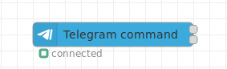  
**Fig. 8:** Command node appearance

### Configuration
The node's configuration contains the following special properties:
- **Command**: The command which shall be implemented.   
  Commands usually start with a / like for example /foo. According to the telegram api documentation the command should be issued following the bot name like /foo@YourBot. This is important when you add several different bots to one single group chat.
- **Register at telegram server** flag: To automatically register the command and the description at the telegram server.  
- **Description**: The description is used when the command should be published via /setMyCommands at the telegram server.  /
  It is optional if the **Register at telegram server** flag is not checked.
- **Language**: The 2 digit language code (see ISO-639-1). If this field is empty it will be shown in every language, otherwise only to the users that have set the language of their client to this language.
- **Scope**: The scope to register the command to: see also [BotCommandScope](https://core.telegram.org/bots/api#botcommandscope).
- **Strict in group chats** flag: To avoid that the bot handles commands that are not directly sent to it using the long notation (e.g. /foo@YourBot) you can set the "strict" mode in the options of the command node. In this case the bot only accepts the full command notation in group chats.
- **Has response output** flag: This enables the second output (*Unathorized Output*). Otherwise the node only has one single output.
- **Use Regex** flag: Allows the usage of regular expressions as command. E.g. ^/toggle_ allows all commands starting with /toggle_.  
- **Remove Command** flag: This optional flag is used when **Use Regex** is checked. If checked it removed the matched command from the beginning of the message. If your command contains addressinformation you should uncheck this flag to be able to parse this information on your own.  


### Outputs
The node has up to two outputs (selectable via the *Has response output* flag):
1. The node's first/upper output (***Standard Output***) is used if the message is from an authorized user and it contains a specified command at the beginning of the message.  
2. The node's second/lower output (***Unauthorized Output***) is used in all other cases. This may be the case when security is applied (via configuration properties *Users* and *ChatIds*) and the user is not authorized to access the bot or if it is from an autorized user and the message does not contain a specified command.

The second output is useful when you want to use a keyboard. See example below.  
It is only issued if a command was received before. If another command was triggered in the meantime, the pending status of the first one is reset. The state is stored per user and per chat.


## Event Node
A telegram node that triggers the output when a event is received from a chat.

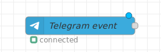  
**Fig. 9:** Event node appearance

The node receives events from the bot like:
- **Callback Query** of inline keyboards. See example-flow [inline keyboard flow](examples/inlinekeyboard.json) in examples folder.
- **Inline Query** of inline bots. See [Inline mode](https://core.telegram.org/bots/api#inline-mode) in the bot API.
- **Edited Message** which is triggered when someone alters an already sent message.
- **Edited Message Text** which is triggered when someone alters an already sent message text.
- **Edited Message Caption** which is triggered when someone alters an already sent caption e.g. of a photo.
- **Channel Post** which is triggered when the bot is member of a public channel (/setprivacy to disabled!).
- **Edited Channel Post** which is triggered when someone alters an already sent message in a public channel.
- **Edited Channel Post Text** which is triggered when someone alters an already sent message text in a public channel.
- **Edited Channel Post Caption** which is triggered when someone alters an already sent caption of e.g. a photo in a public channel.
- **Pre Checkout Query** which is triggered when someone issues a payment (see send invoice).
- **Shipping Query** which is triggered when someone issues a shipping.
- **Chosen Inline Result** which is triggered when a user has chosen a result from an inline query.
- **Poll** which is triggered when a poll is created.
- **Poll Answer** which is triggered when a poll is answered.
- **My Chat Member** which is triggered when the status of the bot is changed.
- **Chat Join Request** which is triggered when a chat join request is issued.
Note that - **Chat Member** is deactivated as it requires special rights by the bot and modifications in polling.


### Configuration
The Event to be received is configured via the node's configuration dialog:

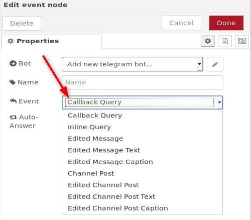

**Fig. 10:** Event node configuration dialog

With the ***Event*** property the listening event is selcted.

The ***Auto-Answer*** checkbox can be set for Callback_Query. If activated, you do not need to send an explicit answer to the bot on your own.


### Outputs
The output `msg.payload` typically contains the parsed data as follows:
- ***chatId:*** Unique identifier for this chat
- ***messageId:*** Telegram message identifier
- ***type:*** Event type (see configurable events above)
- ***date:*** Timestamp
- ***content:*** The actual UTF-8 text of the message
Other properties may be present depending on the type of message.

The output `msg.originalMessage` contains the raw data object from the underlying library, and contains many useful properties.


See also the following descriptions for the event handling:
- callback_query, edited_message, channel_post, edited_channel_post: [Getting updates](https://core.telegram.org/bots/api#update)
- edited_message_text, edited_message_caption: [Updating messages](https://core.telegram.org/bots/api#updating-messages)
- inline_query: [Inline mode](https://core.telegram.org/bots/api#inline-mode)


## Reply Node
A telegram node that is triggered when someone answered to a specified message.

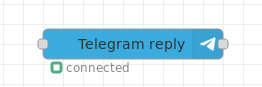  
**Fig. 11:** Reply node appearance

The reply node waits for an answer to a specified message. It should be used in conjunction with the sender node.

### Input
Standard Input: Calls the *onReplyToMessage* of the bot.

### Output
Standard Output: Contains the result from the *onReplyToMessage* call.

This node may be useful, when the bot e.g. sent a message and you want to take some action when someone responded to this specified message. Responding to messages is done by clicking on the message in your client and choose *answer* from the popup.

The `msg.payload` contains:
- **chatId** : Destination chatId
- **sentMessageId** : The id of the previously sent message in the chat
- **content** : The message content.


## Control Node
This node can be used to stop, start, restart a bot (config node).
It send a message to the output after every poll cycle.
See the example flow [**control bot**](examples/control.json) in the examples folder.

### Input
The `msg.payload` contains:
- **command** : 'start' | 'stop' | 'restart'
- **delay** : Optional delay (between stop and start) in milliseconds for 'restart'.

### Output
Standard Output: Contains the msg object passed to the input or a message with poll information:
- **cycle** : Polling cycle number.
- **duration** : Duration in milliseconds for the request.


# Keyboards

## General
Keyboards can be used to interact with the user by displaying a flexibly definable keyboard. The user then presses one of the keys to give his selection.   
Two different keyboard types are available:
- ***Custom Keyboards*** - These are keyboards which replace the standard keyboard. They are located below the message enter area.
- ***Inline Keyboards*** - These are keyboards which are inline in the message area.

A remarkable feature of *Inline Keyboards* is the ability to change them on the fly. See examples section for further details.

With keyboards also complex keyboard procedures with several hierarchy levels  can be implemented to direct the user in a step by step button pressing procedure.


## Custom keyboards
Examples for *Custom keyboards* can be seen in the [Keyboards section](https://core.telegram.org/bots#keyboards) of the telegram bot description.

Custom keyboards act with ***message nodes*** and ***telegram receiver nodes*** to handle the keyboard procedure, which is as follows:
1. The appearance of the keyboard is initiated via a *message* sent to the bot. In the message the keyboard configuration is defined within the `msg.payload.options` property.
2. The user presses a displayed key.
3. The key text is sent back via a *message*. This message is received with a *receiver node* and can then be evaluated.


The keyboard configuration contains the key description, layout and further options. A description of it can be found in the [ReplyKeyboardMarkup](https://core.telegram.org/bots/api#replykeyboardmarkup) section.   
See also the custom keyboard example.

A basic flow handling a custom keyboard with its reply shows the following figure.

  
[**custom keyboard basic flow**](examples/basiccustomkeyboard.json)  
**Fig. 12:** Custom keyboard basic flow example

<details>
  <summary>Click to expand code snippet for <em><b>build keyboard</b></em> function</summary>

```javascript
var opts = {
  reply_markup: JSON.stringify({
    keyboard: [
      ['A1'],
      ['A2']],
      'resize_keyboard' : true,
      'one_time_keyboard' : true
  })
};


msg.error = false;
// Dialogaufbau
msg.payload.content = 'Selection?';
msg.payload.options = opts;


msg.payload.chatId = 123445;
msg.payload.messageId = 99;
msg.payload.sentMessageId = 99;
msg.payload.type = "message";

return [ msg ];
```
</details>

<br>

The look&feel at a mobile device could look like the following figure:

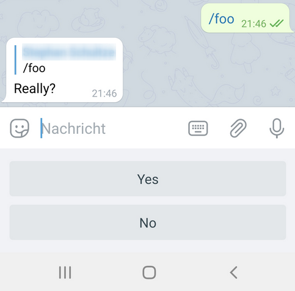  

**Fig. 13:** Custom keyboard example screenshot

The answering options are located below the user text input field.  

Several options for the keyboard layout can be found there in the [Telegram Bot API SDK description](https://irazasyed.github.io/telegram-bot-sdk/usage/keyboards/).   
The keyboard layout shown in Fig. 12 (given in the *create response* node) is
 ```javascript
keyboard: [
   ['Yes'],
   ['No']],
```

Another example of a different key layout may be to arrange several keys in one line.
This may be like:
```javascript
keyboard: [
  ['Yes','No','Maybe'],
  ['Conditional']],
```

This leads to a layout like:

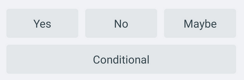  

**Fig. 14:** Custom keyboard example screenshot with different layout


## Inline keyboards
Examples for *Inline keyboards* can be seen in the [Inline keyboards section](https://core.telegram.org/bots#inline-keyboards-and-on-the-fly-updating) of the telegram bot description.

Inline keyboards act with ***message nodes*** and ***event nodes*** (event *Callback Query*) to handle the keyboard procedure, which is as follows:
1. The appearance of the keyboard is initiated via a *message* sent to the bot. In the message the keyboard configuration is defined within the `msg.payload.options` property.
2. The user presses a displayed key.
3. The key text is sent back via an *Callback Query* event. This message is received with an *event node* and can then be evaluated.


The keyboard configuration contains the key description, layout and further options. A description of it can be found in the [InlineKeyboardMarkup](https://core.telegram.org/bots/api#inlinekeyboardmarkup) section.   
See also the inline keyboard example.

A basic flow handling an inline keyboard with its reply shows the following figure.

  
[**inline keyboard basic flow**](examples/basicinlinekeyboard.json)  
**Fig. 15:** Inline keyboard basic flow example

<details>
  <summary>Click to expand code snippet for <em><b>build keyboard</b></em> function</summary>

```javascript
var opts = {
  reply_markup: JSON.stringify({
    "inline_keyboard": [[
                {
                    "text": "A1",
                    "callback_data": "1"            
                },
                {
                    "text": "A2",
                    "callback_data": "2"            
                }]
            ]
  })
};

msg.payload.content = "Selection?";
msg.payload.options = opts;
msg.payload.chatId = 12345;
msg.payload.messageId = 99;
msg.payload.sentMessageId = 99;
msg.payload.type = "message";

return [ msg ];
```
</details>

<br>

The look&feel at a mobile device could look like the following figure:

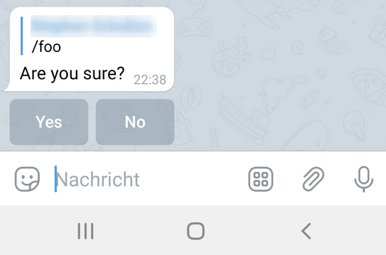  

**Fig. 16:** Inline keyboard example screenshot

The answering options are located within the dialog field.  

Several options for the keyboard layout can be found there in the [Telegram Bot API SDK description](https://irazasyed.github.io/telegram-bot-sdk/usage/keyboards/).   
The keyboard layout shown in Fig. 15 (given in the *inline keyboard message* node) is
 ```javascript
"inline_keyboard": [[
      {"text": "Yes","callback_data": "FOO YES"},
      {"text": "No", "callback_data": "FOO NO"}
]]
```

Another example of a different key layout may be to arrange several keys in one line.
This may be like:

```javascript
"inline_keyboard": [[
      {"text": "Yes","callback_data": "FOO YES"},
      {"text": "No","callback_data": "FOO NO"}],
    [
      {"text": "#1","callback_data": "FOO ONE"},
      {"text": "#2","callback_data": "FOO TWO"},
      {"text": "#3","callback_data": "FOO THREE"}
    ],
    [
      {"text": "dog","callback_data": "FOO DOG"},
      {"text": "eel","callback_data": "FOO EEL"},
      {"text": "cow","callback_data": "FOO COW"},
      {"text": "cat","callback_data": "FOO CAT"}
    ]
]
```

This leads to a layout like:

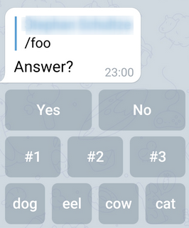   

**Fig. 17:** Inline Keyboard example screenshot with different layout


# Examples
***
**Remark**: Example flows are present in the examples subdirectory. In Node-RED they can be imported via the import function and then selecting *Examples* in the vertical tab menue.  
All example flows can also be found in the examples folder of this package.
***

## Implementing a simple echo
This example is self-explaining. The received message is returned to the sender.

  
[**echo flow**](examples/echo.json)  
**Fig. 18:** Simple echo flow


## Implementing a /help command
This flow returns the help message of your bot. It receives the command and creates a new message, which is returned:

  
[**help message flow**](examples/sendhelpmessage.json)  
**Fig. 19:** Help command flow example


<details>
  <summary>Click to expand code snippet for <em><b>create help text</b></em> function</summary>

```javascript
var helpMessage = "/help - shows help";

helpMessage += "\r\n/foo - opens a dialog";

helpMessage += "\r\n";
helpMessage += "\r\nYou are welcome: "+msg.originalMessage.from.username;
helpMessage += "\r\nYour chat id is " + msg.payload.chatId;
helpMessage += "\r\n";

msg.payload.content = helpMessage;

return msg;
```
</details>

<br>

The output looks on a mobile device like the following figure:

  
**Fig. 20:** Help command screenshot


**Note**: You can access the sender's data via the `msg.originalMessage` property.


## Implementing a custom keyboard
Custom keyboards are very useful for getting additional data from the sender.
When the command is received the first output is triggered and a dialog is opened:

  
[**keyboard flow**](examples/keyboard.json)  
**Fig. 21:** Keyboard example

The answer is send to the second output triggering the lower flow. Data is passed via global properties here.  

<details>
  <summary>Click to expand code snippet for <em><b>confirmation message</b></em> function</summary>

```javascript
context.global.keyboard = { pending : true };

var opts = {
  reply_to_message_id: msg.payload.messageId,
  reply_markup: JSON.stringify({
    keyboard: [
      ['Yes'],
      ['No']],
      'resize_keyboard' : true,
      'one_time_keyboard' : true
  })
};

msg.payload.content = 'Really?';
msg.payload.options = opts;

return [ msg ];
```
</details>

<details>
  <summary>Click to expand code snippet for <em><b>create response</b></em> function</summary>

```javascript
if (context.global.keyboard.pending) {
    context.global.keyboard.pending = false;

    if(msg.payload.content === 'Yes') {
        msg.payload.content = 'Yes';
        return [msg, null];
    }
    else     {
        msg.payload.content = 'No';
        return [null, msg];
    }
}
```
</details>


## Implementing an on reply node
Next to the keyboard the bot could also ask a question and wait for the answer.
When the user responds to a specified message the telegram reply node can be used:


[**onreplymessage flow**](examples/onreplymessage.json)  
**Fig. 22:** On reply example flow

The question is sent to the chat. This node triggers the on reply node waiting for the answer.

**Note**: The user has to explicitly respond to this message. If the user only writes some text,
the get reply node will not be triggered.


<details>
  <summary>Click to expand code snippet for <em><b>create question</b></em> function</summary>

```javascript
msg.payload.type = 'message';
msg.payload.content = 'Really?';
msg.payload.options = {reply_to_message_id : msg.payload.messageId}

return [ msg ];
```
</details>

<details>
  <summary>Click to expand code snippet for <em><b>switch answer</b></em> function</summary>

```javascript
if(msg.payload.content === 'Yes')
{
    return [msg, null];   
}
else
{
    return [null, msg];   
}
```
</details>


## Implementing an inline keyboard
An inline keyboard contains buttons that can send a callback query back to the bot to trigger any kind of function.
When the command is received the first output is triggered and a inline keyboard is shown:

  
[**inlinekeyboard flow**](examples/inlinekeyboard.json)  
**Fig. 23:** Inline keyboard example flow

The callback query is received by the event node. It must be answered like shown as follows.
There you can add your code to trigger the desired bot command. The answer contains the callback query data in `msg.payload.content`.

<details>
  <summary>Click to expand code snippet for <em><b>inline keyboard message</b></em> function</summary>

```javascript
var opts = {
  reply_to_message_id: msg.payload.messageId,
  reply_markup: JSON.stringify({
    "inline_keyboard": [[
                {
                    "text": "Yes",
                    "callback_data": "FOO YES"
                },
                {
                    "text": "No",
                    "callback_data": "FOO NO"
                }]
            ]
  })
};

msg.payload.content = 'Are you sure?';
msg.payload.options = opts;

return [ msg ];
```
</details>

<details>
  <summary>Click to expand code snippet for <em><b>set answer options</b></em> function</summary>

```javascript
var show_alert = false; // you can set this to true to open a dialog with the answer in the client.

// msg.payload.content contains the callback data from the keyboard.
// You may change this value here.
msg.payload.options = show_alert;

return [ msg ];
```
</details>


## Edit an inline keyboard
An inline keyboard can be modified using the 'editMessageReplyMarkup' instruction. To be able to modify an existing message you need to know the messageId of the message of the keyboard.
A sample flow is provided in the examples folder and could look like this:

  
[**editinlinekeyboard flow**](examples/editinlinekeyboard.json)  
**Fig. 24:** Edit an inline keyboard example flow

The message id needs to be saved in the flow or global context (via node *save messageId*). This is just a demo assuming that there is only one single chat.  

As next the initial keyboard has to be replaced with a modified one using the api command *editMessageReplyMarkup* command as type (via node *edit inline keyboard message*).  
As an alternative to '*editMessageReplyMarkup* you can also use the api command *editMessageText* to replace the keyboard and also the text as given in the function example *edit message text*.

The switch node *evaluate callback query* just handles the response and hides the keyboard using another api command *deleteMessage*.  

<details>
  <summary>Click to expand code snippet for <em><b>initial inline keyboard message</b></em> function</summary>

```javascript
context.global.keyboard = { pending : true, messageId : msg.payload.messageId };

var opts = {
  reply_to_message_id: msg.payload.messageId,
  reply_markup: JSON.stringify({
    "inline_keyboard": [[
                {
                    "text": "Yes",
                    "callback_data": "FOO YES"
                },
                {
                    "text": "No",
                    "callback_data": "FOO NO"
                }]
            ]
  })
};

msg.payload.content = 'Do you want to hide the inline keyboard?';
msg.payload.options = opts;

return [ msg ];
```
</details>

<details>
  <summary>Click to expand code snippet for <em><b>save messageId</b></em> function</summary>

```javascript
// We store the messageId to be able to edit this reply in the callback query.
context.global.keyboard.messageId = msg.payload.sentMessageId;
return [ msg ];
```
</details>

<details>
  <summary>Click to expand code snippet for <em><b>edit inline keyboard message</b></em> function</summary>

```javascript
// This is the message id of the initial keyboard that is simply exchanged by a new one.
var messageId = context.global.keyboard.messageId;

// This is a sample of how to send a second inline keyboard with modified buttons
var reply_markup = JSON.stringify({
    "inline_keyboard": [[
                {
                    "text": "Are you really sure?",
                    "callback_data": "FOO YES REALLY"
                },
                {
                    "text": "No",
                    "callback_data": "FOO NO"
                }]
            ]
  });


var options = {
    chat_id : msg.payload.chatId,
    reply_markup : reply_markup,
    message_id : messageId
};

msg.payload.type = 'editMessageReplyMarkup';
msg.payload.content = reply_markup;
msg.payload.options = options;

return [ msg ];
```
</details>

<details>
  <summary>Click to expand code snippet for <em><b>evaluate callback query</b></em> function</summary>

```javascript
// This is a sample switch to demonstrate the handling of the user input.
if(msg.payload.content === "FOO YES REALLY")
{
    // Hide the keyboard and forget the messageId
    msg.payload.type = 'deleteMessage';
    msg.payload.content = context.global.keyboard.messageId
    context.global.keyboard.messageId = null;

    // You could also send a editMessageReplyMarkup with an empty reply_markup here
    return [ null, msg ];
}
else
{
    var show_alert = false; // you can set this to true to open a dialog with the answer in the client.

    // msg.payload.content contains the callback data from the keyboard.
    // You may change this value here.
    msg.payload.options = show_alert;

    return [ msg, null ];
}
```
</details>

<details>
  <summary>Click to expand code snippet for <em><b> an alternative to node edit inline keyboard message</b></em> function</summary>

```javascript
// This is the message id of the initial keyboard that is simply exchanged by a new one.
var messageId = context.global.keyboard.messageId;

// This is a sample of how to send a second inline keyboard with modified buttons
var reply_markup = JSON.stringify({
    "inline_keyboard": [[
                {
                    "text": "Are you really sure?",
                    "callback_data": "FOO YES REALLY"
                },
                {
                    "text": "No",
                    "callback_data": "FOO NO"
                }]
            ]
  });


var options = {
    chat_id : msg.payload.chatId,
    reply_markup : reply_markup,
    message_id : messageId
};

msg.payload.type = 'editMessageText';
msg.payload.content = "Confirmation question";
msg.payload.options = options;

return [ msg ];
```
</details>

<br>

The following figure shows the behaviour on a mobile device (e.g. cell phone). The example given above replaces the button description within the node *edit inline keyboard message*:

  
**Fig. 25:** Edit an inline keyboard example screenshot


## Implementing an inline_query
Bots can be called from any chat via inline_query when the bot is set to inline mode in botfather via /setinline (see https://core.telegram.org/bots/api#inline-mode).  
A sample flow is provided in the examples folder and could look like this:

  
[**inlinequery flow**](examples/inlinequery.json)  
**Fig. 26:** inline_query example flow  

The inline_query must be answered by sending a results array.
See https://core.telegram.org/bots/api#inlinequeryresult.  
The example just returns two simple articles, but almost every kind of content can be returned.

Note that the inline_query can also contain the location of the sender. To enable this call /setinlinegeo in botfather.

<details>
  <summary>Click to expand code snippet for <em><b>create results</b></em> function</summary>

```javascript
// we have to set the results propery with the answer(s)
// see https://core.telegram.org/bots/api#inlinequeryresult
var results = [
    // result 1 is InlineQueryResultArticle
    {
        type : "article",
        id : "1",
        title : "Result 1",

        // InputTextMessageContent see https://core.telegram.org/bots/api#inputmessagecontent
        input_message_content : {
            message_text : "The message 1",
            parse_mode : "Markdown",
            disable_web_page_preview : true
        }
    },

    // result 2 is InlineQueryResultArticle
    {
        type : "article",
        id : "2",
        title : "Result 2",

        // InputTextMessageContent see https://core.telegram.org/bots/api#inputmessagecontent
        input_message_content : {
            message_text : "The message 2",
            parse_mode : "Markdown",
            disable_web_page_preview : false
        }
    }
];

msg.payload.results = results;

return msg;
```
</details>


## Receiving a location
Locations can be send to the chat. The bot can receive the longitude and latitude:

  
[**receivinglocation flow**](examples/receivinglocation.json)  
**Fig. 27:** Receiving a location example  

<details>
  <summary>Click to expand code snippet for <em><b>create location message</b></em> function</summary>

```javascript
if(msg.payload.location) {
    var lat = msg.payload.location.latitude;
    var lng = msg.payload.location.longitude;
    var user = msg.payload.from.username;

    msg.payload.type = 'message';
    msg.payload.content = user + ' moved to lat=' + lat + ' lon=' + lng;

    return msg;
}
else {
    return null;
}
```
</details>


## Sending messages to a specified chat
If you have the chatId, you can send any message without the need of having received something before.

  
[**sendmessagetochat flow**](examples/sendmessagetochat.json)  
**Fig. 28:** Sending messages to a chat example flow  

Sending markdown contents in messages is described below.

<details>
  <summary>Click to expand code snippet for <em><b>send to specific chat</b></em> function</summary>

```javascript

msg.payload = {chatId : 138708568, type : 'message', content : 'ping'}

return msg;
```
</details>


## Sending photos, videos, ...
Additionally to sending text messages you can send almost any file based content like photos and videos. Set the right type and content and you are done.
If you want to respond to a received message with a picture you could write:
```javascript
msg.payload.content = 'foo.jpg';
msg.payload.type = 'photo';
```

**Note**: The chatId is already the correct one when you reuse the received msg object from a receiver node.

You can use one of the following types to send your file as content:
- [photo](examples/sendphoto.json)
- audio
- video
- video_note
- sticker
- dice
- animation
- voice
- document

Note that some clients convert gif animations to videos. This will lead to problems when passing a received animation object to the
sender node as the content is mp4 instead of gif.
The content can be downloaded automatically to a local folder by setting the **Download Directory** property in the receiver node configuration dialog.
You can add a caption to photo, audio, document, video, video_note, animation, voice by setting the caption property as follows:
```javascript
msg.payload.caption = "You must have a look at this!";
```

The following types require a special content format to be used. See the underlying node api for further details.
- location
- contact
- venue
- mediaGroup

An example flow to send a photo is shown in the following figure:

  
**Fig. 29:** Photo sending example flow

<details>
  <summary>Click to expand code snippet for <em><b>send picture</b></em> function</summary>

```javascript
msg.payload.content = 'foo.jpeg';
msg.payload.type = 'photo';

/* type can be one of the following
photo
audio
video
sticker
dice
voice
document
*/

return msg;
```
</details>

Instead of passing a file name you can also directly pass the buffer of a photo as msg.payload.content.
This is useful whenever you download files or already have the buffer in memory from a previous action.
The following example demonstrates how to accomplish this:
[SendPhotoBuffer](examples/sendphotobuffer.json)

<details>
  <summary>Click to expand code snippet for <em><b>send picture buffer</b></em> function</summary>

```javascript
msg.payload.content = buffer;
msg.payload.type = 'photo';

/* type can be one of the following
photo
audio
video
sticker
dice
voice
document
*/

return msg;
```
</details>


### Sending a mediaGroup as album

To send several photos as an album you can use the mediaGroup type. For this type of media group you have to set the content to an array of object type [InputMediaPhoto](https://core.telegram.org/bots/api#inputmediaphoto).
The contents of the `msg.payload`object is shown below (in JSON format).

An example flow sending a media group is shown in the following figure:

  
[**sendmediagroup flow**](examples/sendmediagroup.json)  
**Fig. 30:** Sending media group example flow


<details>
  <summary>Click to expand code snippet for <em><b>create media group</b></em> function</summary>

```javascript
// sendMediaGroup example: send  between 2 and 10 media.
// Note that type can also be video.
// and the caption property is optional.
// see https://core.telegram.org/bots/api#inputmediaphoto
// see https://core.telegram.org/bots/api#inputmediavideo

msg.payload.type = "mediaGroup";
msg.payload.content = [
    {
        type : "photo",
        media : "/pic/frame_1.jpg",
        caption : "Photo 1"
    },
    {
        type : "photo",
        media : "/pic/frame_2.jpg",
        caption : "Photo 2"
    }
];

return msg;
```
</details>


## Sending contacts
Sending a contact is limited to the elements supported by the underlying API to "phone_number" and "first_name".
But you can also receive "last_name" if the client sends it.

```javascript
msg.payload.type = 'contact';
msg.payload.content : {  phone_number: "+49 110", first_name: "Polizei" };
```
An example flow sending a contact is shown in the following figure:

  
[**sendcontacttochat flow**](examples/sendcontacttochat.json)  
**Fig. 31:** Sending contact example flow

<details>
  <summary>Click to expand code snippet for <em><b>contact</b></em> function</summary>

```javascript
msg.payload =
{
    chatId : 12345,
    type : "contact",
    content :
    {
        phone_number: "+49 30 987654321",
        first_name: "Max",
        last_name: "Mustermann"
    },
    options :
    {
        disable_notification : true
    }
}

return msg;
```
</details>

The display within the telegram app of a sent contact may look like this:

  
**Fig. 32:** Sending contact example screenshot


## Sending chat actions
When the bot needs some time for further processing but you want to give a hint to the user what is going on, then you can send a chat action which will appear at the top of the channel of the receiver.
You can either use "sction" or "sendChatAction" as type:
 
```javascript
msg.payload.type = 'action';
msg.payload.content = "typing";
```

The content can be one of the following
- **typing** for text messages
- **upload_photo** for photos
- **record_video** or **upload_video** for videos
- **record_audio** or **upload_audio** for audio files
- **upload_document** for general files
- **find_location** for location data
- **record_video_note** or **upload_video_note** for video notes

The following example illustrate how to send for example "typing...".
Of course a real bot would send the real data after finishing the processing, but this is not part of the example.

An example flow sending a chat action is shown in the following figure:

  
[**sendchataction flow**](examples/sendchataction.json)  
**Fig. 33:** Sending chat actions example flow

<details>
  <summary>Click to expand code snippet for <em><b>send chat action</b></em> function</summary>

```javascript
// demonstrates sending a chat action (see https://core.telegram.org/bots/api#sendchataction)
var type = msg.payload.type;
msg.payload.type = "action";

switch(type){
    case "message":
        msg.payload.content = "typing";
        break;

    case "photo":
        msg.payload.content = "upload_photo";
        break;

    case "video":
        msg.payload.content = "upload_video";
        break;

    case "audio":
        msg.payload.content = "upload_audio";
        break;

    case "document":
        msg.payload.content = "upload_document";
        break;

    case "location":
        msg.payload.content = "find_location";
        break;

    case "video_note":
        msg.payload.content = "upload_video_note";
        break;

    default:
        msg = null;
        break;
}

return msg;
```
</details>


## Sending live locations
Locations can be send to the chat as described above and then updated afterwards: live location update.
To achieve this, you have to provide the live_period in seconds in the options when sending the location.

```javascript
msg.payload.type = 'location';
msg.payload.content = {
    latitude : lat,
    longitude : lng
};

msg.payload.options = {
    live_period : time
};  
```

To be able to update this location message you need to store the message id of that sent message.
This can be done by storing it somewhere in the flow context as follows:

```javascript
var messageId = msg.payload.sentMessageId;
flow.set("messageId", messageId);
```

Now you can edit the location as often as you want within the live_period using the API command **editMessageLiveLocation**:

```javascript
var messageId = flow.get("messageId");
var chatId = msg.payload.chatId;

msg.payload.type = 'editMessageLiveLocation';
msg.payload.content = {
    latitude : lat,
    longitude : lng
};

msg.payload.options = {
    chat_id : chatId,
    message_id : messageId
};  
```

If you want to abort updating the location then you can send the API command **stopMessageLiveLocation**.

```javascript
var messageId = flow.get("messageId");
var chatId = msg.payload.chatId;

msg.payload.type = 'stopMessageLiveLocation';
msg.payload.options = {
    chat_id : chatId,
    message_id : messageId
};  
```

An example flow sending the live location is shown in the following figure:

  
[**livelocation flow**](examples/livelocation.json)  
**Fig. 34:** Sending live location example flow


## Receiving live location updates
When a user sends his location then it is received by the standard message receiver node.
In the case of a live location update, you will receive the same message event as one would edit an already existing message in the chat (edit_message). The example above contains an event handler node that receives those message edits, and filters for the ones that contain a location.


## Forwarding messages
All types of  messages can be forwarded to another chat (see forwardMessage).
Just send a message to the sender node and add forward property to the payload. The forward object must contain the **chatId** of the chat the message should be sent to.
In the following example the received message will be forwarded to the chat 1:

```javascript
msg.payload.forward = { chatId : 1 };
return msg;
```
You can pass the optional paramaters via mag.payload.forward.options.
See the example flow [**forward message**](examples/forwardmessage.json) in the examples folder.

The **messageId** to forward is taken from: `msg.payload.messageId`.
The source **chatId** is taken from: `msg.payload.chatId`.
Both properties are set by the receiver node, but you can also set those manually without having received anything.
The following example sends message 2 from chat 1 to chat 3:

```javascript
msg.payload.chatId = 1;
msg.payload.messageId = 2;
msg.payload.forward = { chatId : 3 };
return msg;
```

Remark: You need to have sufficient permissions to be able to do this message forwarding.


## Copying messages
All types of  messages can be copied to another chat (see copyMessage).
Just send a message to the sender node and add copy property to the payload. The copy object must contain the **chatId** of the chat the message should be sent to.
In the following example the received message will be copied to the chat 1:

```javascript
msg.payload.copy = { chatId : 1 };
return msg;
```
You can pass the optional paramaters via mag.payload.copy.options.
See the example flow [**copy message**](examples/copymessage.json) in the examples folder.

Remark: You need to have sufficient permissions to be able to do this message forwarding.


## Downloading files manually
The receiver node can automatically download files into the configured download directory.
You can also download the files manually using a fileId by passing the following message to the sender node:

```javascript
msg.payload.download = { 
  fileId : "<yourfileidhere>",
  filePath : "c:\\downloaddirectory",
  fileName : "foo.jpg" // this is optional
  };
return msg;
```

See the example flow [**download file**](examples/downloadfile.json) in the examples folder.


## Getting file information manually
If you do not want to download a file but forward a weblink, then you can retrieve the info using getfile.
You can also get the file information manually using a fileId by passing the following message to the sender node:

```javascript
msg.payload.getfile = { 
  fileId : "<yourfileidhere>",
  };
return msg;
```

See the example flow [**download file**](examples/getfile.json) in the examples folder.


## Creating polls
You can create polls, listen to poll events and even receive polls.
A poll can be created using the following pattern:

```javascript
msg.payload.type = 'poll';
msg.payload.content = "What do you think?";
msg.payload.options = ["A", "B", "C" ];
// you can add optional parameters see https://core.telegram.org/bots/api#sendpoll
msg.payload.optional = { allows_multiple_answers : true };
return msg;
```

See the example flow [**create poll**](examples/createpoll.json) in the examples folder.

Use the event node 'Poll' for receiving the updated poll results.


## Web App Data
WebApps is a new feature described here: https://core.telegram.org/bots/webapps
You need to run your web app using a public web server. The url of this web page can be used to communicate with the bot.
Note that the communication must use the https protocol.

See the example flow [**web app data**](examples/webappdata.json) in the examples folder.


## Advanced options when sending messages
Text messages can be formatted as markdown, e.g. to support bold and italic style. To enable markdown format
set the *parse_mode* options property as follows:
```javascript
msg.payload.options = {parse_mode : "Markdown"};
```
or 
```javascript
msg.payload.options = {parse_mode : "MarkdownV2"};
```

An example function node may contain:

  
[**sendmessagetochat flow**](examples/sendmessagetochat.json)  
**Fig. 35:** Sending messages to a chat example flow  

<details>
  <summary>Click to expand code snippet for <em><b>send markdown</b></em> function</summary>

```javascript
var message = 'You can also send *markdown* formatted messages.';
msg.payload = {chatId : 138708568, type : 'message', content : message};

// activate markdown
msg.payload.options = {disable_web_page_preview : true, parse_mode : "Markdown"};

return msg;
```
</details>

<br>


Telegram always adds a preview when you send a web link. To suppress this behavior you can disable the preview
by setting the *disable_web_page_preview* options property as follows:
```javascript
msg.payload.options = {disable_web_page_preview : true};
```

The callback query answer has a show_alert option to control the visibility of the answer on the client.
It is directly mapped to the options property.
```javascript
msg.payload.options = true;
```


## Configuring security
The configuration node contains two properties for applying security to your bot. You can choose between configuring the single user names or configure one or more chatIds that are allowed to access the bot. The values must be separated by a comma like shown in the screenshot.

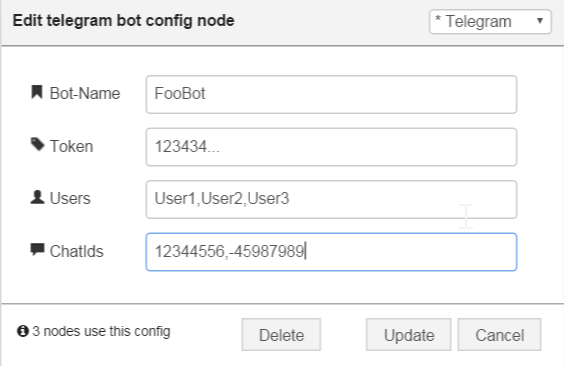

**Fig. 36:** Security configuration in the bot configuration node

**Note**: The *Users* in the security configuration are defined via their usernames. These usernames are configured in the telegram app via the settings dialog. Configured usernames typically begin with a '@' in the app. In the *Users* field, no '@' is used.

**Note**: The chatIds are positive in chats where you talk to the bot in an 1:1 manner. A negative chatId indicates a group chat.
Everybody in this group is allowed to use the bot if you enter the chatId of the group into the lower field of the configuration node.


## Detecting unauthorized access
The receiver node has a second output, that is triggered when authorization fails. The message is send to this output for further processing.
You can reply on that message or log it to a file to see who wanted to access your bot.

  
[**unauthorizedaccess flow**](examples/unauthorizedaccess.json)  
**Fig. 37:** Detecting unautorized access example flow

The message needs to be formatted before the log to file node can be triggered.

<details>
  <summary>Click to expand code snippet for <em><b>create log string</b></em> function</summary>

```javascript
var chatId = msg.payload.chatId;
var username = msg.originalMessage.from.username;

msg.originalMessage.timestamp = new Date();
var message = JSON.stringify(msg.originalMessage);

msg.topic = username + ' ' + chatId;
msg.payload = [msg.topic, message];

return msg;
```
</details>

<br>


## Dynamic authorization
If you want to authorize and unauthorize users or chats during runtime you can insert a script into the config instead of a hard coded list.
The script starts with { and ends with }.
Generally spoken you can make use of the context in two ways (e.g. in a function node):
1. context.global.mykey = myvalue; // = old notation
2. global.set(mykey, myvalue); // = new notation

Only the latter one can be seen in the context browser window while the first is only stored as variable in memory.
For using a dynamic list stored in the context you must add a script into the configuration (in the row Users and/or ChatIds):
1. {context.global.hereyourkey} for approach one
2. {gobal.get("hereyourkey")} for approach two

If the config starts with { and ends with } the expression is evaluated as a script.
For example you can write something like
```javascript
{context.global.username}
{context.global.chatids}
```
or
```javascript
{global.get("usernames")}
{global.get("chatids")}
```

Usage of the latter notation is recommended.

The following example flow shows the various options:

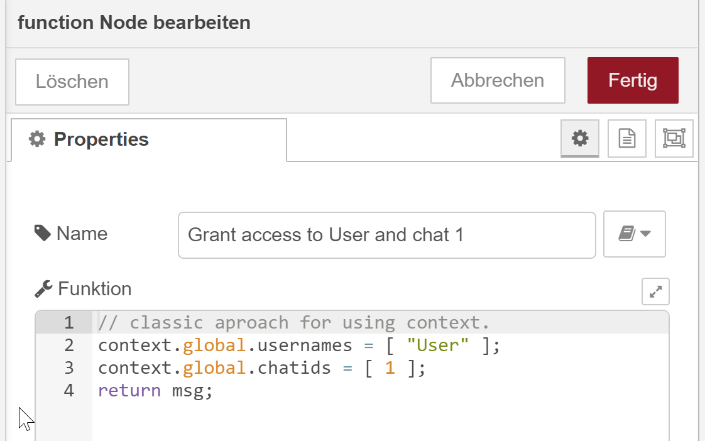  

[**dynamic authorization flow**](examples/dynamicauthorization.json)  
**Fig. 38:** Dynamic granting access example flow

The configuration dialog for scripting contents looks like this:

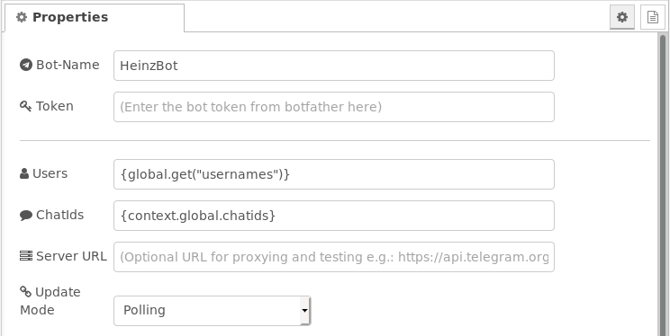

**Fig. 39:** Dynamic authorization with scripting contents

The authorization can be modified using a change node:

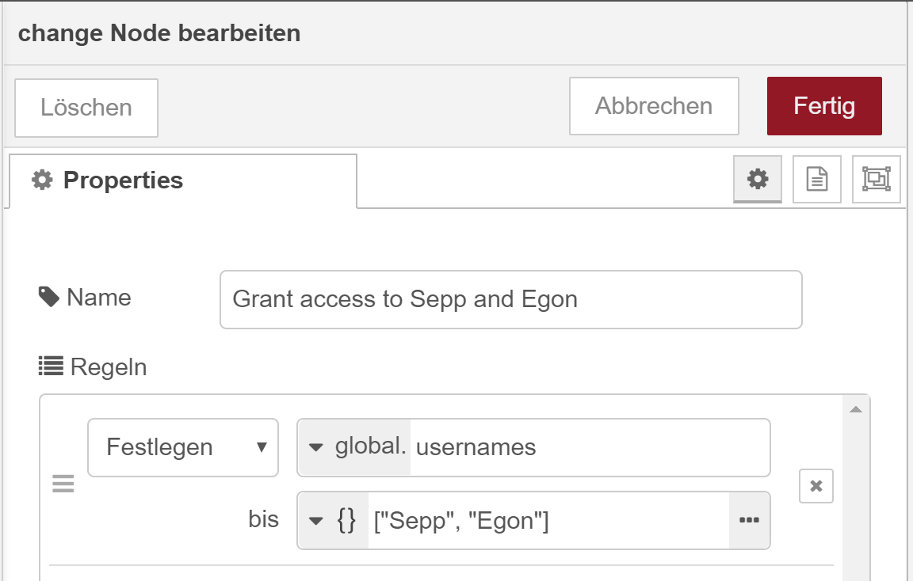

**Fig. 40:** Granting access using a change node

As an alternative, the authorization can be modified using a function node:

Note that you can also use the function node with the new notation like gobal.set(key, value).


<details>
  <summary>Click to expand code snippet for <em><b>Grant access to User and chat 1</b></em> function</summary>

```javascript
// classic aproach for using context.
context.global.usernames = [ "User" ];
context.global.chatids = [ 1 ];

return msg;
```
</details>

<details>
  <summary>Click to expand code snippet for <em><b>No Access</b></em> function</summary>

```javascript
// classic aproach for using context.
context.global.usernames = [];
context.global.chatids = [];

return msg;
```
</details>

<br>

## Restricting permissions in super groups
If you make your bot administrator of a super group then you can use it to restrict permissions of users.
See code below for the different options and the documentation here:
https://core.telegram.org/bots/api#restrictchatmember


<details>
  <summary>Click to expand code snippet for <em><b>Restrict permission of User in super group</b></em> function</summary>

```javascript
var userId = <add your id here>;
var superGroupId = <add your id here>;
var seconds = 60 
var options = {
	// set your permissions here:
	can_send_messages : false,
	can_send_media_messages : false,
	can_send_polls : false,
	can_send_other_messages : false,
	can_add_web_page_previews : false,
	can_change_info : false,
	can_pin_messages : false,
	can_invite_users: true,
	
    until_date: Math.round(((new Date()).getTime() + seconds * 1000) / 1000),
}

var payload = {
    type: "restrictChatMember",
    chatId: superGroupId,
    content: userId,
    options: options
}

msg.payload = payload;

return msg;
```
</details>

<br>


## Pin a sent message to a group
If your bot sends a message and you want to pin that sent message, then take the message id of the sent message as content and pin it using the following code.
See documentation here:
https://core.telegram.org/bots/api#pinchatmessage


<details>
  <summary>Click to expand code snippet for <em><b>Pin a sent message to a group</b></em> function</summary>

```javascript
```
var chatId = <your chatId here>;
var message = msg.payload.sentMessageId;

var options = {
    disable_notification: true
}

var payload = {
    type: "pinChatMessage",
    chatId: chatId,
    content: message,
    options : options
}

msg.payload = payload;

return msg;
```
```
</details>

<br>


## Payments
For a full description of how to handle payments see
https://core.telegram.org/bots/payments  
https://core.telegram.org/bots/api#sendinvoice

[**send invoice flow**](examples/sendinvoice.json)
[**full payment example flow**](examples/sendInvoice2.json)


## Implementing a simple bot
Putting all pieces together you will have a simple bot implementing some useful functions.

  
[**simplebot flow**](examples/simplebot.json)  
**Fig. 41:** Simple bot example flow


# License
Author: Karl-Heinz Wind

The MIT License (MIT)
Copyright (c) <year> <copyright holders>

Permission is hereby granted, free of charge, to any person obtaining a copy of this software and associated documentation files (the "Software"), to deal in the Software without restriction, including without limitation the rights to use, copy, modify, merge, publish, distribute, sublicense, and/or sell copies of the Software, and to permit persons to whom the Software is furnished to do so, subject to the following conditions:

The above copyright notice and this permission notice shall be included in all copies or substantial portions of the Software.

THE SOFTWARE IS PROVIDED "AS IS", WITHOUT WARRANTY OF ANY KIND, EXPRESS OR IMPLIED, INCLUDING BUT NOT LIMITED TO THE WARRANTIES OF MERCHANTABILITY, FITNESS FOR A PARTICULAR PURPOSE AND NON-INFRINGEMENT. IN NO EVENT SHALL THE AUTHORS OR COPYRIGHT HOLDERS BE LIABLE FOR ANY CLAIM, DAMAGES OR OTHER LIABILITY, WHETHER IN AN ACTION OF CONTRACT, TORT OR OTHERWISE, ARISING FROM, OUT OF OR IN CONNECTION WITH THE SOFTWARE OR THE USE OR OTHER DEALINGS IN THE SOFTWARE.
