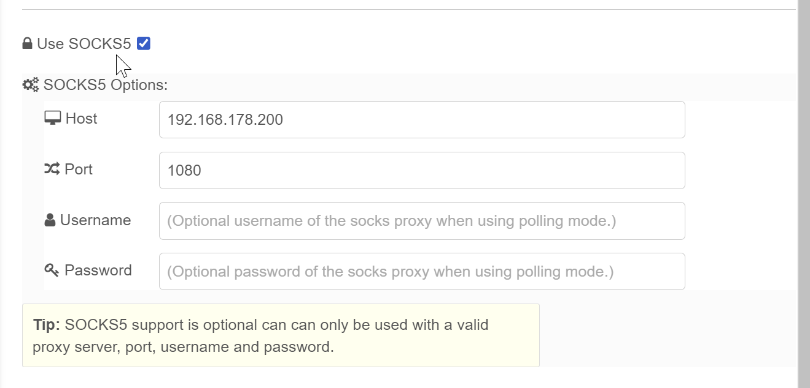
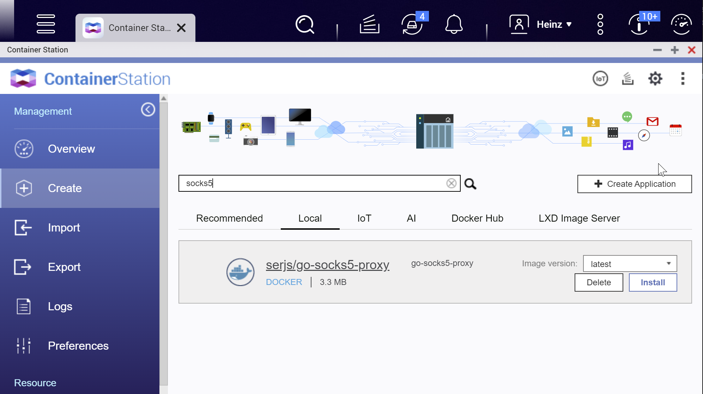
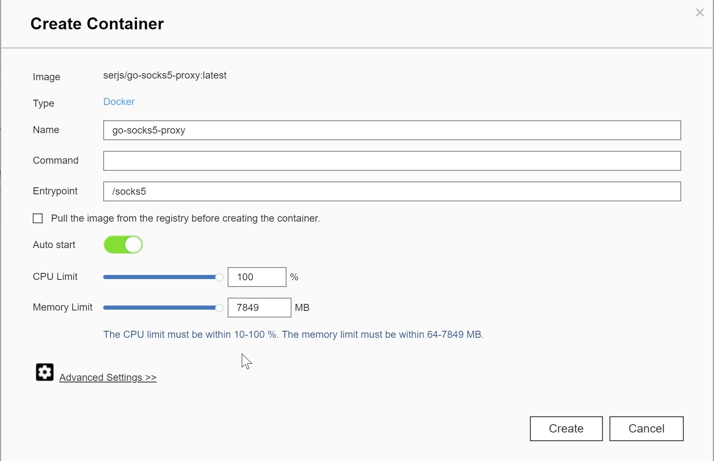
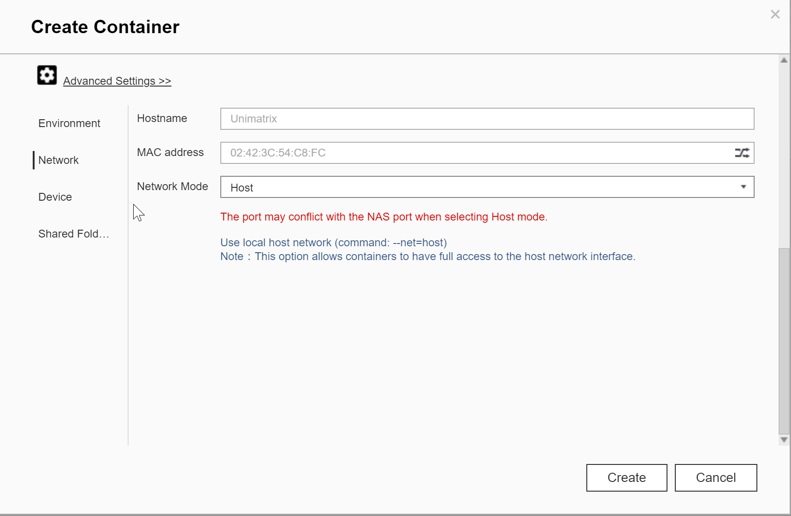
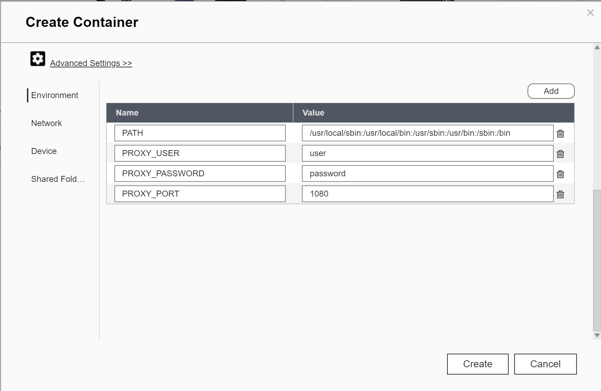
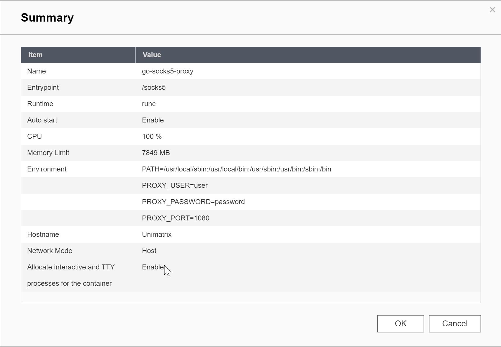
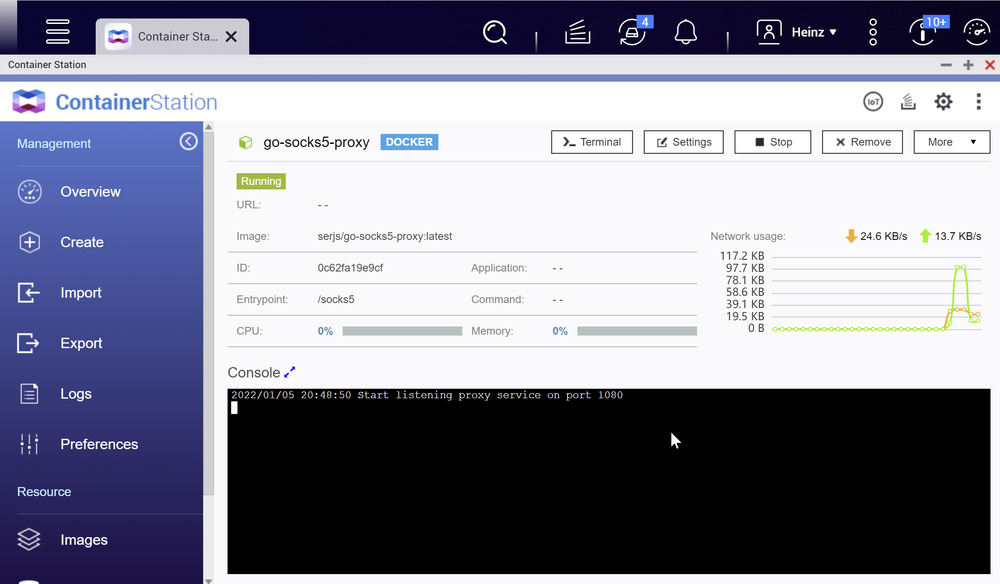
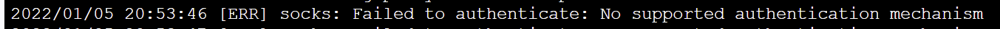
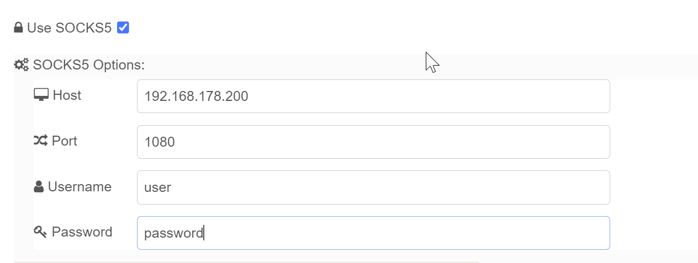

# Socks5 Documentation
You can enable SOCKS proxy support if you want to re-route your calls to the telegram bot api server (api.telergam.org) via an anonymous server.

If the proxy server requires authentication you need to provide a username and password. If not, the fields must be empty:

# General Notes
- The default port for socks5 is 1080.
- As the underlying request lib pools the agent, you need to restart node red when changing IP or the PORT. 

# Finding a SOCKS proxy
## Internet
You can google for free socks5 proxy in the internet to find one, however this is not recommended as you do not know who
is able to intercept your calls to the telegram bot server. Traffic between you and the telegram server is done using the https protocol, but that is not 100% safe. You can also pay a provider of your choice for a socks5 instance running in the internet but the best choice is to set up your own one.

## Localhost (ssh)
You can set up your own server for testing in your local network as follows:
https://catonmat.net/linux-socks5-proxy

## Local network (socks5-server)
An easy way to set up your own server is creating a docker container using socks5-server which is available here:
https://github.com/serjs/socks5-server

### Example using QNAP Container Station

#### 1. Open Container Station and Select "Create" from the menu and search for "serjs/go-socks5-proxy" and install the package.

The image in the screenshot is already downloaded but can be found under the tab "Docker Hub"
See also https://hub.docker.com/r/serjs/go-socks5-proxy/

#### 2. Select Advanced Settings 

#### 3. Configure Network Port 

You can choose NAT or as shown in the screenshot bridge which means that the IP is the one from your NAS and the port is the default one 1080 or the one configured in PROXY_PORT.

#### 4. Configure username and password

Remove PROXY_USER and PROXY_PASSWORD if you do not need any authentication in your local network.

#### 5. Click create to finish configuration

#### 6. The docker image should be up and running 

#### 7. Enter the IP of your Container Station and the port 1080 in your node-red telegram bot configuration and you are done.
Watch the output in the docker console. If user name and passord are wrong the output shows:

#### 8. Enter user name and password in your node-red telegram bot configuration and you are done.

Sometimes reconfiguring the socks5 configuration does not work with redeploy. In this case restart your node-red instance.

#### 9. When the node shows status "Connected" then everything should work as expected..

Network is now routed via the docker image in the container station in your local network.
This is only for testing and not to improve security. Remember that the socks5 proxy should be running somewhere else in the internet.
